# 多智能体协作：角色分工、通信机制与冲突仲裁

多智能体协作是 Agent 面试中越来越高频的方向。随着单 Agent 能力趋近天花板，面试官开始考察：**你能不能设计一个多 Agent 系统，让它们分工明确、协作高效、出了分歧还能收敛。**

---


## 多 Agent 协作基础

### Q：多智能体怎么协作？比如一个写代码一个审查

> 来源：Agent 岗面试高频题

**新手答**：“一个写完发给另一个看就行。”

**高手答**：

多 Agent 协作的核心是**角色隔离 + 通信规范 + 冲突收敛**，不是简单的“你写我看”。

1. **角色定死，职责不交叉**：每个 Agent 的 System Prompt 里明确限定职责和输出格式。比如“程序员”只负责写代码和解释设计意图，“审查员”只负责指出问题和给出修改建议——绝不让审查员自己改代码，否则职责边界模糊，输出会乱
2. **通信用结构化消息**：Agent 之间不传自然语言长文，而是用 JSON 消息体，带上 `task_id`、`role`、`action`、`payload` 等字段。这样既方便下游解析，也方便事后追踪和调试
3. **协作拓扑按场景选**：简单任务用顺序链（写完 → 审查 → 修改）；复杂任务用分治（多个程序员并行写不同模块，汇总后统一审查）；需要讨论的场景用多轮对话（程序员和审查员来回交互，限定最多 3 轮）
4. **冲突必须有收敛机制**：审查员和程序员意见不一致时，不能无限来回。设计一个仲裁者角色（可以是更强的模型，也可以是规则引擎），或者关键步骤直接升级到人工介入

**差距在哪**：新手的回答是一个最简单的两步流程——没有考虑通信格式、冲突处理、拓扑选择。高手的回答覆盖了四个工程维度：角色隔离（谁做什么）、通信规范（怎么传递）、拓扑选择（怎么编排）、冲突收敛（意见不一致怎么办）。面试官考的是“你有没有设计过需要多个组件协作的系统”——多 Agent 协作和微服务架构的思路是相通的。

---

### Q：多 Agent 系统里，怎么防止 Agent 之间“踢皮球”或死循环？

> 来源：Agent 岗面试高频题

**新手答**：“加个超时就行。”

**高手答**：

超时是最后一道防线，但不能只靠它。**踢皮球和死循环的根因是职责模糊或终止条件不明确**：

1. **职责判定前置**：在任务分发层做意图路由，明确判断“这个任务该归谁”。如果路由不确定，直接交给一个“兜底 Agent”处理，而不是让多个 Agent 互相推诿
2. **交互轮次硬限制**：任意两个 Agent 之间的交互最多 N 轮（比如 3 轮），超过就强制输出当前最优结果，不再来回。这个限制写在编排层，Agent 自己不能覆盖
3. **状态机驱动流转**：用状态机管理任务流转，每个状态只能转向有限的下一个状态，不存在“回到原点”的环路。状态转移规则在编排层硬编码，模型无法篡改
4. **全局超时兜底**：整个多 Agent 流程设一个总超时（比如 60 秒），到点不管走到哪一步，都输出当前已有的最优结果并通知用户

**差距在哪**：新手只有超时——这是事后补救。高手的思路是从源头预防：职责判定防踢皮球、轮次限制防无效循环、状态机防非法跳转、超时兜底防极端情况。面试官考的是“你理不理解分布式系统里的活锁问题”，多 Agent 协作本质上就是分布式系统。

---

### Q：多 Agent 之间需要共享状态吗？怎么设计？

> 来源：Agent 岗面试高频题

**新手答**：“放 Redis 里，大家都能读写。”

**高手答**：

需要共享，但**绝不能裸读写**，否则会出现状态冲突和覆盖问题。我们用**黑板模式（Blackboard Pattern）**：

1. **中央状态存储**：一个所有 Agent 都能访问的共享空间（可以是 Redis、数据库、甚至内存字典），存储当前任务的全局状态——任务进度、中间结果、关键决策
2. **读写权限分离**：每个 Agent 只能写自己职责范围内的字段。程序员只能写 `code_output`，审查员只能写 `review_comments`，互不干扰
3. **事件驱动触发**：Agent 不轮询黑板，而是通过事件机制——当某个字段被更新时，自动通知订阅了这个字段的下游 Agent。比如 `code_output` 写入后，自动触发审查员开始工作
4. **版本化防覆盖**：关键字段带版本号，更新时做乐观锁检查，防止并发写入覆盖

**差距在哪**：新手的“放 Redis”解决了存储问题，但没考虑并发冲突、权限隔离、触发机制。高手的黑板模式是一个经典的多智能体架构模式——有读写隔离、事件驱动、版本控制。面试官考的是“你有没有多组件共享状态的设计经验”，如果你做过消息队列或事件总线系统，这道题的思路是一样的。

---


## 单多 Agent 决策与模式

### Q：单 Agent 还是多 Agent 的？子 Agent 的任务是什么？

> 来源：抖音基础架构 Agent 一面

**新手答**：“用一个 Agent 就行。”

**高手答**：

以 AI 代码测试系统为例，用多 Agent 架构，分四个角色：

```text
┌─────────────┐     ┌─────────────┐     ┌─────────────┐     ┌─────────────┐
│  代码分析器   │ ──→ │  测试生成器   │ ──→ │  测试验证器   │ ──→ │  覆盖率检查器 │
│  Analyzer    │     │  Generator   │     │  Validator   │     │  Coverage    │
└─────────────┘     └─────────────┘     └─────────────┘     └─────────────┘
```

1. **代码分析器**：解析待测代码的 AST，提取函数签名、依赖关系、分支结构、复杂度指标，输出结构化的分析报告
2. **测试生成器**：基于分析报告和提示词模板，生成测试代码。它只负责“写”，不负责“验”
3. **测试验证器**：执行生成的测试，检查语法是否正确、能否通过编译、断言是否合理。失败的用例连同错误信息反馈给生成器重试
4. **覆盖率检查器**：跑覆盖率工具，分析哪些分支没覆盖到，把未覆盖的分支信息反馈给生成器做补充生成

拆成多 Agent 的原因：**每个环节的失败模式不同，分开才能精准重试**。生成失败和验证失败的处理逻辑完全不一样，混在一起会导致无效重试。

**差距在哪**：新手默认用单 Agent 解决所有问题。高手的多 Agent 架构有明确的拆分理由——不同环节的失败模式不同，分开才能精准处理。面试官考的是你为什么拆、怎么拆、拆完各个子 Agent 之间怎么协调。

---

### Q：怎么判断一个 Agent 该做成单 Agent，还是多 Agent？

> 来源：腾讯大模型应用开发二面 【阿里国际一面追问：Claude Code 是 multi 还是 single agent】

**新手答**：“复杂任务用多 Agent，简单任务用单 Agent。”

**高手答**：

关键不是任务听起来复不复杂，而是三个判断维度：

1. **能力边界是否清晰**：如果任务里包含明显不同的专业能力（代码修改、合规审查、数据分析），拆开更清晰
2. **上下文是否容易污染**：不同子任务的中间状态混在一起会互相干扰时，隔离有价值
3. **是否存在天然并行**：多个子任务可以同时进行时，多 Agent 能降低总延迟

如果整个任务虽然长，但上下文高度统一，一个 Agent 加状态机通常就够了。

多 Agent 的好处是职责分离、上下文隔离、局部优化方便，但**成本也更高**——需要处理通信、调度和一致性。所以不是越多 Agent 越高级，很多场景单 Agent 反而更稳。只有在“拆开明显比揉在一起更好管”的时候，多 Agent 才值得做。

**差距在哪**：新手用“复杂 vs 简单”做判断——这个维度太模糊。高手给出了三个具体判断标准（能力边界、上下文污染风险、天然并行性），且指出多 Agent 的隐性成本。面试官考的是你选架构时有没有明确的判断框架，而不是凭感觉。

---

### Q：在多 Agent 协作系统中，记忆应该如何共享？是全局共享还是每个 Agent 独立？

> 来源：后端 AI 八股 / Memory 系统 【小红书AI应用开发同题：多Agent上下文管理与共享】

**新手答**：“全部共享，大家都能看到。”

**高手答**：

既不是全局共享，也不是完全独立——是**分层共享**：

| 记忆层 | 共享范围 | 示例 |
|-------|---------|------|
| 全局共享记忆 | 所有 Agent 可读 | 用户画像、系统规则、全局上下文 |
| 团队共享记忆 | 同一任务的 Agent 组可读写 | 当前任务的中间结果、协作状态 |
| 私有记忆 | 单个 Agent 独占 | Agent 自己的推理过程、工具调用中间态 |

关键设计原则：
1. **读写权限分离**：全局记忆大部分 Agent 只读，只有特定角色能写
2. **传结论不传过程**：Agent 之间共享的是结构化结论（“查到用户订单号是 XXX”），不是原始推理链
3. **版本化防冲突**：共享记忆带版本号，并发写入时用乐观锁，防止互相覆盖
4. **按需订阅**：Agent 不轮询共享记忆，而是订阅自己关心的字段变更，事件驱动

全局共享的风险是上下文污染——A Agent 的中间推理被 B Agent 当成事实。完全独立的问题是信息孤岛——Agent 之间重复劳动。分层共享是平衡点。

**记忆隔离与上下文污染防治**：

在多 Agent 系统中，不同 Agent 使用不同工具，工具返回的原始数据如果不经处理就写入共享记忆，会造成**跨工具上下文污染**——A Agent 的搜索结果被 B Agent 当成事实依据。

防治措施：

| 污染类型 | 具体表现 | 防治方案 |
|---------|---------|---------|
| 工具结果泄漏 | Agent A 的搜索结果被 Agent B 误用 | 工具返回值只写入调用者的私有记忆，共享记忆只存结论 |
| 推理过程泄漏 | Agent A 的 chain-of-thought 被 Agent B 当成事实 | 严格区分“推理过程”和“确认结论”，只共享后者 |
| 状态竞态 | 并发 Agent 同时更新共享状态，互相覆盖 | 乐观锁 + 版本号，冲突时由编排层仲裁 |
| 角色混淆 | 共享上下文中包含多个 Agent 的指令，模型混淆角色 | 每条共享信息标注来源 Agent ID 和角色 |

核心原则：**共享记忆中只存“what”（结论和事实），不存“how”（推理过程和工具原始返回）**。每个 Agent 的 thinking 和 tool outputs 严格限制在私有空间内。

**差距在哪**：新手要么全共享（污染风险）要么全独立（效率低）。高手用三层共享模型平衡了协作效率和隔离安全，且给出了权限、传递、版本、订阅四个关键设计点。面试官考的是你对多组件共享状态的架构设计能力。

---

### Q：多 Agent 设计里，按“职能拆分”和按“阶段拆分”各有什么优缺点？

> 来源：Agent 开发面试 30 题

**新手答**：“按职能拆更清晰。”

**高手答**：

两种拆分方式解决的是不同的问题，不存在“哪个更好”：

**按职能拆分（Functional Split）**：

```text
用户请求 → 路由器 → 搜索 Agent / 计算 Agent / 写作 Agent / 数据库 Agent
```

每个 Agent 有独立的能力域，路由器根据用户意图分发。

| 优点 | 缺点 |
|------|------|
| 职责清晰，每个 Agent 的 Prompt 和工具集精简 | 复杂任务需要多个 Agent 协作，通信成本高 |
| 单个 Agent 可独立优化和测试 | 路由器成为单点瓶颈，路由错了全盘皆输 |
| 新增能力只需加一个 Agent，不影响其他 | 跨 Agent 的状态共享是难题 |

**按阶段拆分（Stage Split）**：

```text
用户请求 → 理解 Agent → 规划 Agent → 执行 Agent → 总结 Agent
```

每个 Agent 负责任务流水线的一个阶段，依次传递。

| 优点 | 缺点 |
|------|------|
| 流程清晰，每步输出是下步输入 | 增加一个阶段需要改整条链路 |
| 天然适合有明确先后依赖的任务 | 前一阶段出错，后续全部受影响（错误级联） |
| 状态传递简单（线性传递） | 不适合需要灵活分支的场景 |

**实际工程中的选择标准**：

- 任务类型多样、各子任务独立性强 → 职能拆分（如客服系统：查询/投诉/咨询各一个 Agent）
- 任务流程固定、阶段依赖强 → 阶段拆分（如代码审查：理解 → 分析 → 修复建议 → 总结）
- 两者可以嵌套：宏观按阶段拆，某个阶段内部按职能拆

**差距在哪**：新手只知道职能拆分。高手对比了两种拆分方式的优缺点和适用场景，且指出两者可以嵌套组合。面试官考的是你在多 Agent 架构设计时有没有系统性的拆分思路。

---


## 通信协议与 Handoff

### Q：Handoff 的核心难点是什么？是路由问题、状态传递问题，还是权限边界问题？

> 来源：Agent 开发面试 30 题

**新手答**：“主要是路由问题，让请求到正确的 Agent。”

**高手答**：

Handoff（Agent 间交接）的难点**三个都有**，但最容易被低估的是**状态传递**。

**路由问题——最显眼但最好解决**：

用意图分类器或模型判断“该交给哪个 Agent”，准确率做到 90%+ 不难。兜底方案也简单——路由错了让目标 Agent 检测到不属于自己的任务后回退。

**权限边界——重要但相对静态**：

每个 Agent 的工具访问权限、数据访问范围可以在配置中明确定义。Handoff 时校验目标 Agent 是否有权限处理该任务。这是设计时就能确定的，运行时不太会变。

**状态传递——最隐蔽也最容易出问题**：

```text
Agent A 和用户聊了 10 轮 → Handoff 到 Agent B
Agent B 需要知道什么？

❌ 把 A 的全部对话历史传过去 → B 的上下文被污染，A 的推理过程干扰 B 的判断
❌ 只传最后一条消息 → B 丢失了关键约束（用户预算、偏好等）
✅ 传结构化的"交接摘要" → 任务目标 + 关键约束 + 已完成步骤 + 未完成步骤
```

状态传递的核心难点是**信息的取舍**——传多了上下文污染，传少了信息缺失。最佳实践是定义标准化的 Handoff Protocol：

```json
{
  "task_goal": "帮用户订北京到上海的机票",
  "constraints": {"budget": 2000, "date": "2026-04-20", "class": "经济舱"},
  "completed_steps": ["已查询航班列表", "用户选择了 CA1234"],
  "pending_steps": ["确认支付", "出票"],
  "handoff_reason": "进入支付环节，需要支付 Agent 处理"
}
```

**差距在哪**：新手只看到路由问题。高手分析了三个难点的层次——路由最显眼但最好解决，权限重要但静态，状态传递最隐蔽也最关键，且给出了标准化 Handoff Protocol 的设计。面试官考的是你对多 Agent 交接的工程化理解深度。

---

### Q：MCP 和 A2A 分别解决什么层面的问题？如果系统同时用了两者，架构上怎么分工？

> 来源：Agent 开发面试 30 题

**新手答**：“MCP 是调工具的，A2A 是 Agent 之间通信的。”

**高手答**：

方向对，但需要精确区分**协议层次和解决的核心问题**：

**MCP（Model Context Protocol）——Agent 与工具/资源的连接协议**：

解决的是“Agent 怎么发现和调用外部能力”——数据库查询、API 调用、文件读写等。本质是**Agent 到工具的标准化接口**，类似于 USB 协议让电脑能接各种外设。

```text
Agent ──MCP──→ 工具 A（数据库查询）
Agent ──MCP──→ 工具 B（搜索引擎）
Agent ──MCP──→ 工具 C（代码执行）
```

**A2A（Agent-to-Agent）——Agent 与 Agent 的协作协议**：

解决的是“多个 Agent 怎么互相发现、通信和协作”——任务委托、结果回传、状态同步。本质是**Agent 到 Agent 的通信协议**，类似于 HTTP 让不同服务之间能互相调用。

```text
Agent A ──A2A──→ Agent B（委托子任务）
Agent B ──A2A──→ Agent A（返回结果）
Agent A ──A2A──→ Agent C（并行委托）
```

**两者同时使用时的架构分工**：

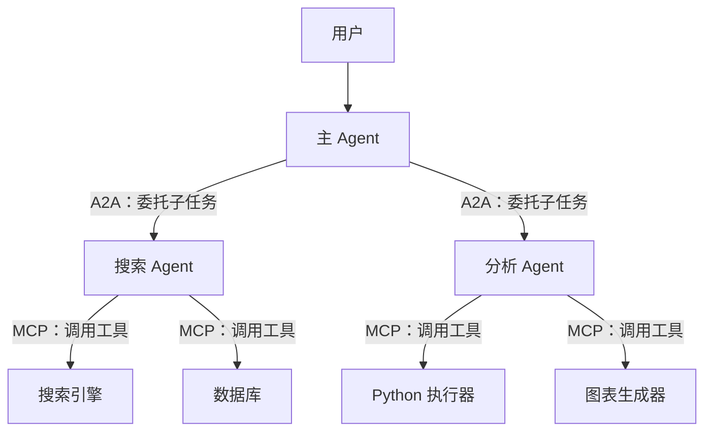

- **A2A 负责“水平”通信**：Agent 之间的任务分发、结果汇总、状态协调
- **MCP 负责“垂直”连接**：每个 Agent 向下调用自己需要的工具和资源

两者不冲突，是**不同层次的协议**——A2A 解决组织协作问题，MCP 解决能力接入问题。类比公司组织：A2A 是部门之间的沟通协议，MCP 是员工使用办公工具的标准接口。

**差距在哪**：新手把两者简单对立。高手明确了两者的协议层次（水平通信 vs 垂直连接），且给出了同时使用时的架构图和分工原则。面试官考的是你对 Agent 协议生态的理解——不只是“知道”这两个概念，而是知道它们在系统架构中的位置。

---


## SubAgent 设计

### Q：什么时候该用 subagent？为什么工具调用多就倾向用 subagent？

> 来源：蚂蚁集团一面 【小红书 Agent 岗一面追问：多 Agent 相比单 Agent 的优势及上下文压力】

**新手答**：“工具调用多就用 subagent，少就不用。”

**高手答**：

用不用 subagent 的核心判断不是“工具调用多不多”，而是**上下文隔离的收益是否大于通信的成本**。

**什么时候该用 subagent**：

1. **子任务会产生大量中间结果，但主任务只需要最终结论**：比如“搜索 10 个文件找到某个函数定义”——subagent 内部产生大量搜索结果和文件内容，主 agent 只需要一个文件路径和行号。如果不用 subagent，这些中间结果会污染主 agent 的上下文窗口
2. **子任务的上下文和主任务高度不相关**：主任务在做代码重构规划，中间需要查一下某个 API 的用法文档——两者的上下文完全不同，混在一起会干扰主任务的推理
3. **需要并行处理多个独立子任务**：比如同时在三个模块里查找某个接口的调用方，三个搜索互不依赖，用 subagent 可以并行执行

**为什么工具调用多就倾向用 subagent**：

工具调用多意味着**中间状态膨胀快**。每次工具调用的输入和返回都会占用上下文窗口：

```text
主 agent 直接调 10 次工具：
  上下文增量 = 10 × (工具调用描述 + 工具返回结果) ≈ 数千 token
  → 主任务的原始上下文被稀释，推理质量下降

用 subagent 封装：
  上下文增量 = 1 × subagent 返回的结论摘要 ≈ 几百 token
  → 主任务上下文保持干净
```

本质上，subagent 是一种**上下文管理策略**——用进程隔离的思路解决上下文污染问题。和操作系统里“子进程做脏活、父进程只看结果”是同一个思路。

**差距在哪**：新手把 subagent 当成”工具调用多时的自动选择”。高手理解 subagent 的核心价值是上下文隔离，判断标准是”中间结果对主任务有没有价值”。面试官考的是你对上下文管理的工程化理解。

**追问：主 Agent 和子 Agent 共用同一个上下文吗？**

> 来源：bilibili AI研发实习一面

**答案是：不共用，这正是 subagent 存在的意义。**

主 Agent 和子 Agent 各自维护独立的上下文窗口，通过**结构化消息**而非共享上下文来通信：

```text
主 Agent 上下文：
  [系统指令] [用户任务] [规划结果] [子Agent1的结论] [子Agent2的结论]
  
子 Agent 上下文：
  [系统指令] [主Agent分配的子任务] [工具调用1] [工具返回1] [工具调用2] [工具返回2] ...
```

主 Agent 看不到子 Agent 的工具调用细节，子 Agent 也看不到主 Agent 的全局规划和其他子 Agent 的结果。两者之间的通信是：

| 方向 | 传递内容 | 形式 |
|------|---------|------|
| 主→子 | 子任务描述 + 必要上下文 | 结构化的任务指令 |
| 子→主 | 执行结论 + 关键数据 | 结构化的结果摘要 |

**为什么不共用上下文**：

1. **上下文污染**：子 Agent 执行 10 次工具调用产生的中间结果，会把主 Agent 的任务目标和关键约束”淹没”，导致主 Agent 推理质量下降
2. **窗口浪费**：主 Agent 不需要知道子 Agent 的每一步操作细节，只需要最终结论。共用上下文意味着大量无用信息占据宝贵的窗口空间
3. **职责混乱**：共用上下文后，子 Agent 可能被主 Agent 的其他指令干扰，偏离自己的子任务目标

**类比**：主 Agent 是项目经理，子 Agent 是具体执行者。经理不需要看到执行者的每一封邮件和每一次会议记录——只需要一份结论报告。这就是上下文隔离的核心思想。

---

### Q：任务简单但工具调用多，用 subagent 是否浪费 token？怎么解决？

> 来源：蚂蚁集团一面

**新手答**：“简单任务就不用 subagent 了，直接调工具。”

**高手答**：

这个问题的核心矛盾是：**subagent 有启动成本（system prompt + 上下文初始化），但简单任务的推理本身不需要那么多 token**。

先量化一下成本：

| 方案 | token 消耗构成 | 适合场景 |
|------|-------------|---------|
| 主 agent 直接调工具 | 工具调用 × N（累积在主上下文中） | 工具调用少（<3 次），结果对主任务有用 |
| 启动完整 subagent | system prompt + 任务描述 + N 次工具调用 + 总结 | 工具调用多，需要独立推理 |
| 轻量级工具链 | 预定义的工具编排序列，无需模型推理 | 流程固定，不需要模型判断 |

**解决方案是分层处理**：

1. **简单 + 工具少**（如“读取某文件的第 10 行”）→ 主 agent 直接调，不值得启动 subagent
2. **简单 + 工具多但流程固定**（如“在 5 个目录里分别执行 ls”）→ 用**轻量工具链**，把多次工具调用编排成一个复合操作，不经过模型推理，零 token 消耗
3. **简单 + 工具多但需要判断**（如“搜索某个函数定义，可能在多个文件里”）→ 用 subagent，但**精简 system prompt**，只给必要的任务描述，不加载完整的能力描述

关键洞察：**“浪费 token”的根源不是 subagent 本身，而是没有根据任务复杂度调整 subagent 的“规格”**。就像不需要为查一个文件启动一台虚拟机——轻量容器就够了。

**差距在哪**：新手把 subagent 当成全有或全无的选择。高手给出了三级分层方案——直接调用、轻量工具链、精简 subagent，根据任务特征选最经济的方案。面试官考的是你对 Agent 系统成本控制的精细化思维。

---

### Q：图片信息怎么在 subagent 之间流转？

> 来源：蚂蚁集团一面

**新手答**：“把图片传给下一个 subagent 就行。”

**高手答**：

图片在 subagent 间流转的核心挑战是**多模态数据的序列化成本远高于文本**。一张图片编码成 token 可能占几百到上千 token，如果在 subagent 之间原样传递，成本和延迟都会爆炸。

**三种流转策略**：

**1. 传引用，不传内容（首选）**

```text
subagent A 处理图片 → 输出：{image_ref: "cache://img_001", description: "架构图，包含三层..."}
subagent B 接收引用 → 需要时才通过 image_ref 加载原图
```

把图片存在共享缓存（内存/磁盘/对象存储），subagent 之间只传引用 ID 和文本描述。大多数下游 subagent 只需要文本描述就够了，只有真正需要“看图”的 subagent 才加载原图。

**2. 传结构化摘要（最省 token）**

如果上游 subagent 已经理解了图片内容，直接传结构化的理解结果：

```json
{
  "image_type": "流程图",
  "entities": ["用户请求", "API 网关", "服务集群"],
  "relationships": ["用户请求 → API 网关 → 服务集群"],
  "key_info": "三层架构，网关做鉴权和限流"
}
```

下游 subagent 拿到结构化数据就能工作，完全不需要再看图片。

**3. 多分辨率传递（平衡质量和成本）**

对同一张图片生成多个版本：缩略图（低 token）、中等分辨率、原图。根据下游任务需要选择合适的分辨率：

- 只需要判断“这是什么类型的图” → 缩略图
- 需要读取图中文字 → 中等分辨率
- 需要精细分析细节 → 原图

**核心原则**：图片数据在 subagent 间流转时，**能用文本描述替代就用文本，能用引用替代就用引用，只有确实需要视觉理解时才传递图片本体**。这和微服务间传大对象的思路一样——传 ID 不传 blob。

**差距在哪**：新手想到的是直接传图片——这是最暴力也最浪费的方式。高手给出了引用传递、结构化摘要、多分辨率三种策略，核心思想是“尽可能用低成本的信息载体替代高成本的原始数据”。面试官考的是你对多模态系统中数据流转的工程化设计能力。

---


## 编排与路由

### Q：多 Agent 怎么编排的？用的什么编排模式？

> 来源：百度实习 AI 应用开发一面

**新手答**：“一个调一个，串行执行。”

**高手答**：

多 Agent 编排的本质是**决定谁在什么时候做什么、信息怎么流转**。不同任务复杂度对应不同的编排模式，没有万能方案：

**四种核心编排模式**：

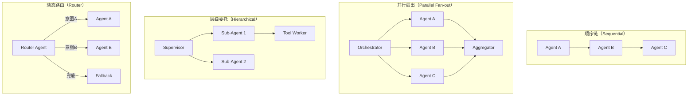

| 编排模式 | 适用场景 | 优点 | 缺点 |
|---------|---------|------|------|
| **顺序链** | 流程固定、步骤间有依赖 | 简单可控、易调试 | 延迟线性增长、一步出错全链断 |
| **并行扇出** | 子任务独立、可并发 | 总延迟 = 最慢子任务 | 需要聚合逻辑、结果可能冲突 |
| **层级委托** | 复杂任务需要递归拆解 | 灵活、支持动态子任务 | 嵌套深度需限制、token 成本高 |
| **动态路由** | 多意图入口、一对多分发 | 解耦、易扩展新 Agent | 路由准确率是瓶颈 |

**工程实现的关键决策**：

1. **编排层用代码还是模型？** 生产环境中，主干流程用代码（状态机/DAG）编排，只在需要灵活判断的节点让模型参与路由决策。纯模型编排的不可控风险太高
2. **状态怎么传递？** Agent 之间传递结构化的 State 对象（不是自然语言），包含任务上下文、已完成步骤、中间结果。用共享 State Store（如 Redis）或消息传递（如事件总线）实现
3. **失败怎么处理？** 每个 Agent 节点需要独立的超时和重试策略。关键路径上的 Agent 失败要触发降级或回退，而非让整个编排链崩溃

**实际项目中的常见做法**：

大多数生产系统是**混合编排**——主流程用顺序链保证确定性，子任务内部用并行扇出提升效率，复杂决策节点用层级委托处理。纯用一种模式的系统很少见。

**差距在哪**：新手只想到串行调用——这是最简单的编排模式，且没有容错。高手给出了四种编排模式及其适用场景，且指出生产系统通常是混合编排，关键在于编排层用代码控制主干、状态用结构化对象传递、失败有独立恢复策略。面试官考的是你对多 Agent 系统编排的全局视野。

---

### Q：Multi Agent 系统中 Router 节点依据什么规则把任务分给子 Agent？

> 来源：淘天 AI Agent 二面

**新手答**：“根据关键词匹配分发。”

**高手答**：

Router 是多 Agent 系统的“调度中枢”，它的分发质量直接决定系统上限。分发规则从简单到复杂有**三个层次**：

| 层次 | 方法 | 原理 | 适用场景 |
|------|------|------|---------|
| 规则路由 | 关键词/正则/意图标签匹配 | 预定义路由表，命中即分发 | 意图类型少且边界清晰 |
| 分类器路由 | 轻量分类模型（如 BERT 意图分类器） | 用标注数据训练，输出意图类别 + 置信度 | 意图类型多但有训练数据 |
| LLM 路由 | 让大模型根据任务描述选择子 Agent | Prompt 中列出子 Agent 的能力描述，模型做推理选择 | 开放域任务、难以预定义路由规则 |

**生产级 Router 的设计要点**：

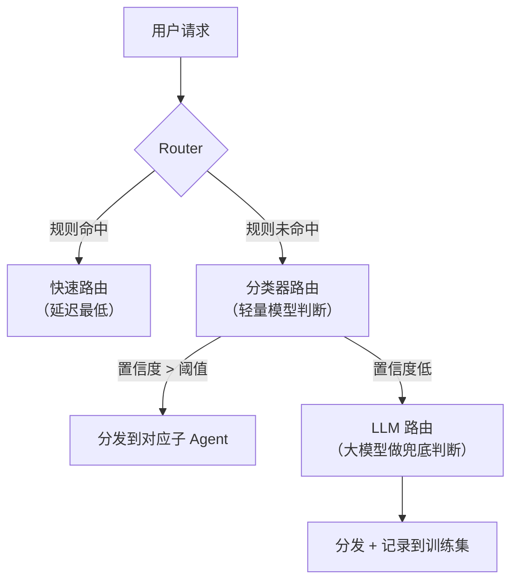

**级联路由**：先用规则（零延迟），命中就走；未命中再用分类器（毫秒级）；分类器置信度低才调 LLM（百毫秒级）。这样 80% 的请求被规则/分类器快速分发，只有边界 case 才用 LLM 做精细判断。

**Router 分发信息应包含什么**：

```text
路由结果 = {
    target_agent: "售后处理 Agent",
    confidence: 0.92,
    task_summary: "用户要求退货，订单号 xxx",
    context_slice: [必要的上下文片段],
    fallback_agent: "通用客服 Agent"  // 目标 Agent 无法处理时的降级
}
```

不只是“发给谁”，还要带上**任务摘要**（避免子 Agent 重新解析原始输入）、**上下文切片**（只给必要信息，不给全量历史）、和**降级路径**。

**Router 的常见失败模式**：

| 失败模式 | 表现 | 解决方案 |
|---------|------|---------|
| 意图重叠 | 两个子 Agent 都能处理，Router 随机分 | 定义优先级 + 能力边界文档 |
| 意图漂移 | 对话中途用户换了话题，但 Router 没重新判断 | 每轮都重新路由，不只在首轮 |
| 置信度盲区 | 分类器给了 0.5 的置信度，不知道分给谁 | 设阈值兜底到 LLM 路由或人工 |
| 路由死循环 | A 转给 B，B 转给 A | 加路由计数器，超过 N 次强制升级 |

**差距在哪**：新手只想到关键词匹配——这在复杂场景下很快失效。高手有三层级联路由（规则 → 分类器 → LLM）的架构设计，且考虑了分发信息完整性、降级路径和常见失败模式。面试官考的是你对多 Agent 编排中”调度”这个关键环节的工程化认知。

**追问：LLM 路由 vs 规则路由，分别有什么优劣势？**

> 来源：阿里淘天 AI应用开发一面

| 维度 | 规则路由 | LLM 路由 |
|------|---------|---------|
| 延迟 | 微秒级，近乎零延迟 | 百毫秒~秒级，需要一次 LLM 推理 |
| 成本 | 零额外成本 | 每次路由消耗 token |
| 可解释性 | 完全透明，规则可审计 | 黑箱，模型可能给不出路由理由 |
| 灵活性 | 差，新意图必须手动加规则 | 强，能处理未见过的意图类型 |
| 准确性（边界清晰场景） | 高，精确匹配不出错 | 可能过度推理导致误分发 |
| 准确性（模糊场景） | 低，规则覆盖不到的全部漏掉 | 高，能做语义级理解 |
| 维护成本 | 规则越多越难维护 | 只需维护 Agent 能力描述 |

**实际选型建议**：不是二选一，而是级联——规则兜已知意图（快+稳），LLM 兜未知意图（灵活），两者互补。

---

### Q：Multi-Agent 中心化编排模式 vs 点对点架构，核心区别和优势是什么？

> 来源：蚂蚁 AI应用开发 二面

**新手答**：「中心化就是有一个主 Agent 指挥别人，点对点是大家直接通信。」

**高手答**：

两种模式的核心区别在于**控制权的分布方式**：

| 维度 | 中心化编排 | 点对点（P2P） |
|------|-----------|-------------|
| 控制权 | 集中在 Orchestrator | 分散在各 Agent |
| 通信模式 | Hub-and-Spoke（星型） | Mesh（网状） |
| 任务分配 | Orchestrator 统一分配 | Agent 间协商或广播 |
| 全局视角 | Orchestrator 掌握全局状态 | 无单一节点有全局视角 |
| 故障影响 | Orchestrator 故障则全局瘫痪 | 单点故障只影响局部 |

**中心化编排的核心优势**：

1. **全局最优调度**：Orchestrator 知道所有子 Agent 的能力和当前负载，能做出全局最优的任务分配决策。P2P 模式下每个 Agent 只有局部信息，容易出现任务冲突或重复执行
2. **一致性保障**：状态集中管理，不会出现「A 以为 B 做完了，B 以为 A 在做」的不一致问题
3. **可观测性**：所有通信经过中心节点，天然有完整的执行链路日志。P2P 的通信分散在各节点之间，追踪和调试困难
4. **流程控制简单**：优先级、超时、取消等控制逻辑只需在 Orchestrator 实现一次

**P2P 的适用场景**：

当 Agent 数量多、任务高度并行、且不需要严格的全局协调时，P2P 更合适——比如信息收集类任务，多个 Agent 各自检索不同来源，结果最后汇总。

**生产实践中的选择**：绝大多数生产系统选中心化编排。原因很实际——可调试性和可控性远重于理论上的去中心化优势。Agent 系统的核心挑战不是「能不能跑」，而是「出了问题能不能查」，中心化在这方面有压倒性优势。

**差距在哪**：新手只说了「一个指挥、一个直接通信」的表面区别。高手从控制权分布、全局视角、一致性、可观测性四个维度做了系统对比，且给出了生产实践中的选择建议和理由。面试官考的是你对多 Agent 系统的工程权衡——不是哪个更「先进」，而是哪个更「可控」。

---

### Q：详细介绍多智能体协同策略——三层 Agent（Root / Main+Fallback / Sub-Agent）是怎么配合流转的？主 Agent 越过中间层直接调子 Agent 时，上下文怎么跨层传递？

> 来源：淘天 Agent 开发

**新手答**：“Root 分发任务，Main 执行，Sub-Agent 做具体工具调用。上下文通过全局变量共享。”

**高手答**：

三层 Agent 架构是处理复杂任务时的经典设计——每一层解决不同粒度的问题：

**架构设计**：

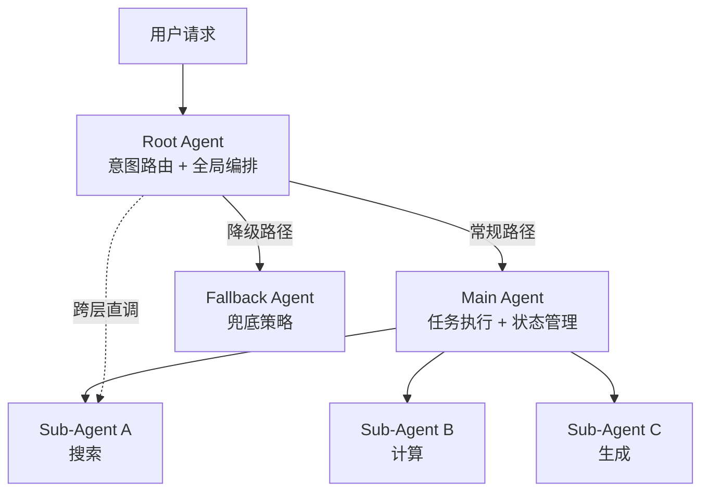

| 层级 | 职责 | 决策范围 |
|------|------|---------|
| **Root** | 意图分类、路由分发、全局异常处理 | 决定「谁来做」 |
| **Main / Fallback** | 任务执行、子任务拆解、结果聚合 | 决定「怎么做」 |
| **Sub-Agent** | 单一能力执行（检索、API 调用、格式化） | 决定「做的细节」 |

**流转机制**：

1. **正常流转**：Root 解析意图 → 路由到 Main Agent → Main 拆解为子任务 → 分发给 Sub-Agent → 结果回流到 Main 聚合 → 返回 Root → 输出
2. **Fallback 触发**：Main Agent 执行失败（超时/错误/置信度低）→ Root 降级到 Fallback Agent（简化策略、规则兜底或直接拒绝）
3. **跨层直调**：Root 识别到某些简单任务不需要经过 Main 的拆解 → 直接调用 Sub-Agent

**跨层上下文传递——不是全局变量，是结构化消息**：

全局变量共享在多 Agent 系统里是反模式——会导致上下文污染和并发冲突。正确做法是**结构化消息传递**：

```text
Root → Sub-Agent 直调时的上下文包：
{
  "intent": "搜索最新政策",        // Root 解析的意图
  "constraints": {"时效性": "7天内"},  // Root 提取的约束
  "context_snapshot": "用户正在咨询...", // 压缩后的会话摘要
  "trace_id": "req-12345"           // 全链路追踪 ID
}
```

关键设计原则：

| 原则 | 做法 |
|------|------|
| **最小上下文** | 每层只传递下一层需要的信息，不传完整对话历史 |
| **结构化而非自由文本** | 用 JSON schema 约束字段，防止信息丢失或格式混乱 |
| **只读快照** | Sub-Agent 拿到的是上下文快照，不能修改上层状态 |
| **结果回传统一格式** | Sub-Agent 返回标准化结果，Main/Root 按需解析 |

**差距在哪**：新手用全局变量做上下文共享——这在生产中会导致并发冲突和上下文污染。高手用结构化消息传递 + 最小上下文原则，既保证了信息完整性，又避免了跨层耦合。面试官考的是你对多层 Agent 系统的工程化设计能力。

---

### Q：为什么大家都在用 Multi-Agent？从一开始到现在原因是否有变化？

> 来源：币安 AI大模型实习一面

**新手答**：“因为单 Agent 做不了复杂任务，所以要拆成多个。”

**高手答**：

Multi-Agent 的流行原因经历了**本质性转变**——从“不得不拆”到“拆了更好”：

**早期原因（2023）——能力不足的变通方案**：

单 Agent 的硬性限制迫使开发者拆分：
- 上下文窗口只有 4K-8K，一个复杂任务的中间状态就能塞满
- 工具调用不稳定，调用链越长出错概率越高
- 推理能力弱，长链路推理容易塌缩

所以当时拆 Multi-Agent 的本质是“**降低单次推理的复杂度**”——每个 Agent 只做一件小事，降低单点失败率。

**现在的原因（2025）——工程最佳实践**：

模型能力大幅提升（200K 窗口、稳定工具调用、强推理），单 Agent 理论上能做更多事了。但 Multi-Agent 依然是主流，原因变了：

| 维度 | 早期动机 | 现在动机 |
|------|---------|---------|
| 上下文 | 窗口太小放不下 | 隔离后每个 Agent 推理质量更高（减少干扰） |
| 专业化 | 模型不够强，需要简化任务 | 针对性 Prompt + 工具集比“全能”更稳定 |
| 并行 | 串行太慢 | 独立子任务并行，总延迟 = 最慢的那个 |
| 可观测性 | 没考虑 | 每个 Agent 可独立追踪、调试、替换 |
| 容错 | 没考虑 | 局部失败不影响全局，可精准重试 |

**本质变化**：从“能力不足的补丁”变成了“工程最佳实践”。

类比微服务演进：不是因为单体“不能跑”才拆微服务，而是因为分开更好维护、更好扩展、更好监控。Multi-Agent 是同样的逻辑——**分离关注点**在任何复杂系统里都是对的。

**一个反直觉的观察**：2025 年模型更强了，但 Multi-Agent 反而**更**流行了。因为模型能力提升让每个子 Agent 更可靠，Multi-Agent 系统的“通信税”相对于每个 Agent 的产出质量来说变得更值得了。以前拆了可能每个 Agent 都不靠谱，现在拆了每个 Agent 都很稳——拆的收益放大了。

**差距在哪**：新手只给出了“复杂任务需要拆分”这一个静态理由。高手梳理了 Multi-Agent 流行原因的演化——从被动应对到主动选择，且用微服务类比说清了本质逻辑。面试官考的是你对技术趋势的深度认知——不只是“知道大家在用”，而是“理解为什么在用、为什么现在还在用”。

---

### Q：Multi-Agent 如何通信？不同项目分别用了哪些通信方法？

> 来源：币安 AI大模型实习一面

**新手答**：“Agent 之间通过消息传递通信。”

**高手答**：

Multi-Agent 通信没有唯一标准，不同项目根据设计哲学选了不同方案。关键是理解**为什么选这种方式**：

**通信模式分类**：

| 通信模式 | 原理 | 代表项目 | 适合场景 |
|---------|------|---------|---------|
| 结构化消息传递 | JSON 消息体带 task_id/role/payload | OpenAI Agents SDK (Handoff) | 任务明确、Agent 间接口清晰 |
| 共享状态黑板 | 中央 State Store，Agent 订阅/写入 | LangGraph（State 对象）、AutoGen | 需要多 Agent 协作修改同一状态 |
| 文件系统中继 | 通过 .md 文件 / git 传递上下文 | Claude Code（CLAUDE.md + Memory） | 人机混合协作、需要人工审查 |
| 事件驱动 | Pub/Sub 模式，Agent 监听事件触发 | Hermes、企业级 Agent 编排 | 解耦强、Agent 数量多 |
| 函数调用委托 | 主 Agent 直接调用子 Agent 作为“工具” | Claude Code（Agent tool）、OpenClaw | 层级关系明确的主从模式 |
| 开放协议（A2A） | Agent Card + Task 生命周期 + JSON-RPC | Google A2A Protocol | 跨框架、跨组织的 Agent 互操作 |

**具体项目对比**：

**Claude Code**：主 Agent 通过 Agent tool 派发子任务（prompt 即通信协议），子 Agent 返回结构化结果。上下文隔离靠独立对话窗口，持久化靠 Memory 文件。通信代价极低——一个函数调用就完成了委托和回收。

**Codex**：多 Agent 通过 git worktree 隔离工作空间，通信靠 PR/commit message。适合并行开发——本质上是“用版本控制做 Agent 间协调”，天然支持冲突检测和合并。

**OpenClaw**：分层压缩记忆 + .md 文件作为 human-in-the-loop 审查接口。Agent 间通过事件触发流转，每次流转都经过人工可审查的中间态。

**Hermes**：情景记忆（Episodic Memory）+ 双索引（语义 + 时间），Agent 间通过事件关联度匹配触发——不是“A 通知 B”，而是“B 订阅了某类事件，A 的输出恰好匹配”。

**MCP vs A2A 协议层次区分**：

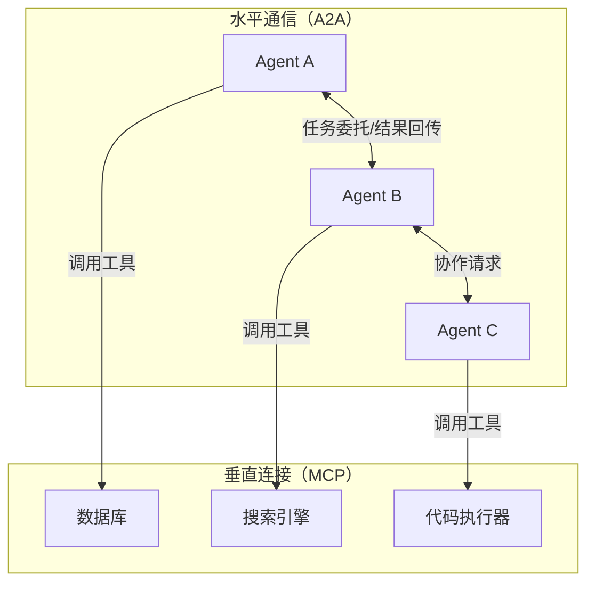

- **MCP**：解决 Agent → 工具/资源 的连接，类比 USB 接口接外设
- **A2A**：解决 Agent → Agent 的跨框架互操作，类比 HTTP 让不同服务互相调用
- 两者协同：A2A 负责水平通信（Agent 间委托任务），MCP 负责垂直连接（Agent 调工具）

**A2A 核心设计**：Agent Card（`/.well-known/agent.json` 声明能力）→ Task 生命周期（submitted → working → completed）→ 支持多轮交互和长时间运行任务。

**差距在哪**：新手只说”消息传递”——这等于没说。高手分析了六种通信模式各自的适用场景，且用具体项目对比说明了设计背后的取舍。面试官考的是你对 Agent 生态的广度认知——不只是”用过一个框架”，而是理解不同框架的通信哲学差异。

---

## Q：如果让两个不同的 Agent 产品进行对话（比如 Claude Code 和 Cursor），在协议层面应该怎么做？

> 来源：字节TikTok AI应用开发一面

**新手答**：”用 API 互相调用呗，一个 Agent 调另一个的接口。”

**高手答**：
这道题考的是跨产品 Agent 互操作（Interoperability）——两个完全独立的 Agent 产品如何协作，而不是在同一框架内的子 Agent 通信。

**协议层选型**：

1. **A2A（Agent-to-Agent Protocol）**：Google 主导的开放协议，专为跨产品 Agent 互操作设计
   - Agent Card：每个 Agent 在 `/.well-known/agent.json` 发布自己的能力声明（输入格式、输出类型、认证方式）
   - Task 生命周期：submitted → working → input-required → completed，支持异步长任务
   - SSE 流式推送 + 多轮交互，天然支持对话式协作

2. **MCP（Model Context Protocol）**：适合工具/资源暴露，但设计上是 Host→Client→Server 单向调用，不是双向 Agent 对话

3. **纯 REST API 对接**：最简单，但耦合度高，需要双方约定接口规范，无法利用标准化协议带来的互操作生态

**实现关键点**：
- **身份认证**：A2A 通过 Agent Card 内的 `securitySchemes` 声明 OAuth2/API Key，跨产品必须解决鉴权
- **能力协商**：A2A 的 Agent Card `skills` 字段描述能力，调用方根据 Card 决定怎么调用，而不是硬编码
- **状态传递**：Task 的 `contextId` 支持多轮对话上下文，每个消息带 `role: agent`，区分于用户消息
- **降级策略**：对方不支持 A2A 时，退化为标准 HTTP + JSON 协议，保留基础互操作能力

**差距在哪**：面试官考的是你对”同框架内的子 Agent 通信”和”跨产品 Agent 互操作”这两个不同层次问题的区分。A2A 的价值在于标准化——就像 HTTP 统一了 Web，A2A 试图统一 Agent 生态的互调方式。

---

## Q：智能体可信通信怎么实现？

> 来源：字节AI开发二面

**新手答**：“用 HTTPS 加密通信就行了。”

**高手答**：

Agent 间可信通信不只是传输层加密，还涉及身份认证和内容完整性：

1. **身份认证**：每个 Agent 需要有独立身份标识（类似 mTLS 的证书体系），通信前互相验证“你真的是你声称的那个 Agent”
2. **消息签名**：Agent 发出的每条消息附带数字签名，接收方可验证消息未被篡改、确实来自声称的发送者
3. **能力声明与授权**：Agent A 调用 Agent B 前，B 需要验证 A 是否有权限请求该能力（类似 OAuth scope）
4. **防 Prompt 注入**：Agent A 传给 Agent B 的内容可能被恶意构造（间接注入），B 需要对输入做净化和边界隔离
5. **审计链路**：所有 Agent 间通信需要留痕（who→whom, when, what），支持事后追溯责任
6. **信任传递控制**：Agent A 信任 Agent B，B 信任 C，不代表 A 自动信任 C——需要显式信任链管理

**差距在哪**：面试官考察你对“Agent 是独立决策实体”的安全意识——不像微服务在同一可信域内，Agent 可能来自不同组织/不同供应商，必须零信任设计。

---

### Q：子 Agent 之间的上下文怎么传递？传什么、不传什么？

> 来源：阿里 Agent 面经

**新手答**：“把上一个 Agent 的输出传给下一个就行。”

**高手答**：

“把输出传给下一个”在简单链路下能工作，但当子 Agent 数量增多或存在并行时，传递不当会导致两个问题：① 传太多——上下文膨胀、推理质量下降；② 传太少——下游 Agent 缺少必要信息，输出偏离。

**核心原则：传结论和约束，不传过程和原始数据**

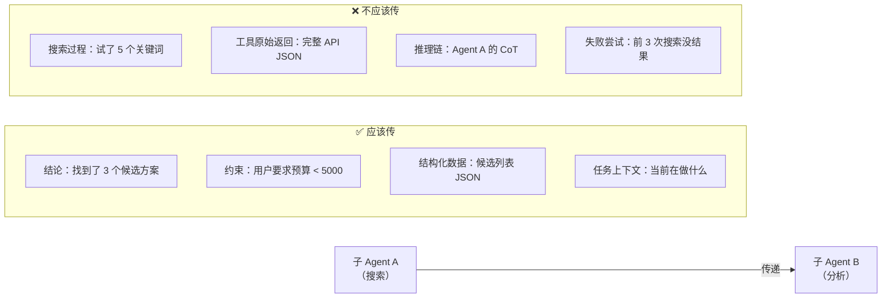

**传递内容的分类设计**：

| 类别 | 传 | 不传 | 原因 |
|------|---|------|------|
| 任务结论 | ✅ 搜索到的关键结果 | ❌ 搜索的中间过程 | 下游只需要结果，不需要知道怎么找到的 |
| 约束条件 | ✅ 用户的硬性要求 | ❌ 已验证满足的约束 | 下游需要遵守约束，但不需要知道上游如何验证 |
| 状态信息 | ✅ 当前进度和待做事项 | ❌ 已完成任务的详细日志 | 下游只需要知道“到哪了”和“接下来做什么” |
| 错误信息 | ✅ 失败结论（“方案 A 不可行”） | ❌ 失败的详细堆栈 | 防止下游重复尝试已知不可行的路径 |

**工程实现——标准化传递格式**：

```text
子 Agent 间传递的消息结构：
{
  "from_agent": "search_agent",
  "to_agent": "analysis_agent",
  "task_id": "task_001",
  "payload": {
    "conclusion": "找到 3 个符合条件的方案",
    "data": [结构化的候选列表],
    "constraints_carried": ["预算 < 5000", "需要支持 iOS"],
    "warnings": ["方案 B 的评价数据较少，置信度低"]
  },
  "context_budget": 800  // 告诉下游这条消息预期占多少 token
}
```

**特殊场景的传递策略**：

| 场景 | 策略 |
|------|------|
| 并行子 Agent 汇总结果 | 每个 Agent 返回独立结论，由聚合层统一整合，不互相传递 |
| 子 Agent 需要回溯上游 | 传引用（task_id + step_id），需要时通过编排层按需加载 |
| 子 Agent 链路很长（>3 跳） | 每跳做一次摘要压缩，防止传递的上下文线性膨胀 |

**差距在哪**：新手把“输出传给下一个”当成全部——这在两个 Agent 的简单链路下没问题，但在多 Agent 系统中会导致信息膨胀或缺失。高手用明确的传/不传分类、标准化消息格式和特殊场景策略，把上下文传递变成了一个可控的工程方案。面试官考的是你对多 Agent 系统中“信息流动”的精细化设计能力。

---

### Q：多 Agent 协作常见模式有哪些？各自适合什么任务类型？

> 来源：阿里 Agent 面经

**新手答**：“就是一个 Agent 做完交给下一个。”

**高手答**：

多 Agent 协作模式远不止“串行传递”。不同的任务特征需要不同的协作拓扑，选错模式会导致效率低下或质量失控。

**五种核心协作模式**：

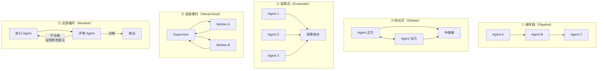

**各模式详细对比**：

| 模式 | 适合任务 | 优势 | 劣势 | 典型场景 |
|------|---------|------|------|---------|
| **顺序链** | 流程固定、步骤有先后依赖 | 简单可控、易追踪 | 一步出错全链断；延迟线性增长 | ETL 数据处理、代码审查 |
| **辩论式** | 需要多角度论证的决策问题 | 减少单一视角偏差 | token 消耗高；需要好的仲裁机制 | 方案评估、风险分析 |
| **投票式** | 不确定性高、需要提升鲁棒性 | 降低单点幻觉风险 | 成本 ×N；投票策略影响结果 | 分类判断、事实验证 |
| **层级委托** | 复杂任务需要动态拆解 | 灵活、支持递归分解 | Supervisor 是瓶颈；嵌套深度需限制 | 项目管理、多步推理 |
| **反馈循环** | 质量要求高、可迭代优化的生成任务 | 输出质量有保障 | 循环次数不可控；需设退出条件 | 代码生成+审查、文案优化 |

**选型决策树**：

```text
任务特征分析：
  ├── 步骤间有强依赖？ → 顺序链
  ├── 需要多角度验证？ → 辩论式 或 投票式
  │     ├── 论证型（方案好不好）→ 辩论式
  │     └── 判断型（是 A 还是 B）→ 投票式
  ├── 任务复杂度未知、需动态拆解？ → 层级委托
  └── 生成质量要求极高？ → 反馈循环
```

**生产中的组合使用**：

实际系统很少只用一种模式。典型组合：
- **主流程用顺序链**（保证确定性）+ **生成环节用反馈循环**（保证质量）
- **外层用层级委托**（动态拆任务）+ **每个子任务用投票式**（提高鲁棒性）

**差距在哪**：新手只知道顺序传递。高手能画出五种协作模式的拓扑图，说清各自的适用场景和权衡，且指出生产中通常是混合使用。面试官考的是你对多 Agent 协作的“模式库”——面对不同任务特征能快速选出最合适的协作拓扑。

---

### Q：主 Agent 与子 Agent 的通信和进度同步怎么做？是推还是拉？

> 来源：广州某小厂 Agent 后端开发二面

**新手答**：“子 Agent 做完了就告诉主 Agent。”

**高手答**：

“做完了通知”只是最简单的情况。实际系统中主 Agent 需要在子 Agent 执行过程中**持续感知进度**——否则无法做超时干预、动态调整、或向用户反馈进展。

**推 vs 拉的对比**：

| 维度 | 推模式（子 Agent 主动上报） | 拉模式（主 Agent 主动查询） |
|------|-------------------------|--------------------------|
| 实时性 | 高——状态变化即时通知 | 依赖轮询频率，有延迟 |
| 资源消耗 | 低——只在状态变化时通信 | 高——空轮询浪费资源 |
| 实现复杂度 | 需要事件机制/回调 | 简单轮询即可 |
| 适合场景 | 子任务执行时间长、进度有多阶段 | 子任务短平快、不关心中间状态 |

**生产环境的最佳实践：推为主、拉为辅**

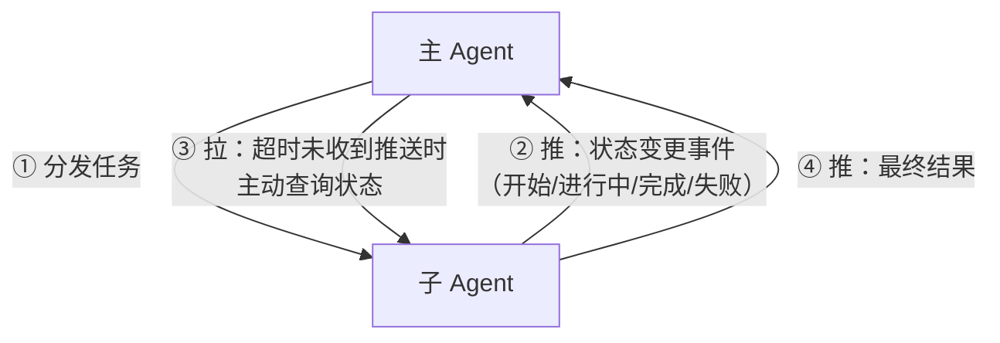

**具体设计**：

**1. 子 Agent 主动推送的时机**：

| 事件 | 推送内容 | 主 Agent 的处理 |
|------|---------|---------------|
| 任务开始 | `{status: "started", estimated_time: 5s}` | 记录开始时间，启动超时计时器 |
| 阶段完成 | `{status: "progress", step: "2/5", intermediate_result: "..."}` | 更新进度，按需向用户反馈 |
| 需要输入 | `{status: "blocked", reason: "缺少参数 X"}` | 决定是追问用户还是从其他来源获取 |
| 任务完成 | `{status: "completed", result: {...}}` | 取消超时计时器，整合结果 |
| 任务失败 | `{status: "failed", error: "...", retry_suggestion: "..."}` | 决定重试/降级/上报 |

**2. 主 Agent 主动拉取的场景**：

```text
- 超时兜底：分发任务后启动计时器，超过预期时间未收到推送 → 主动查询
- 用户催促：用户问"到哪了" → 主 Agent 主动向子 Agent 拉取当前进度
- 动态调整：外部条件变化（如用户修改了需求） → 主 Agent 拉取当前状态后决定是否中断
```

**3. 通信实现方式**：

| 实现方式 | 适用场景 | 技术栈 |
|---------|---------|--------|
| 回调函数 | 同进程内的子 Agent | 直接函数调用，零网络开销 |
| 事件总线 | 同服务内多 Agent | Redis Pub/Sub、内存事件队列 |
| Webhook/SSE | 跨服务的异步 Agent | HTTP 回调或 Server-Sent Events |
| 共享状态轮询 | 最简单的实现 | 子 Agent 写状态到 DB，主 Agent 定期读 |

**4. 进度同步的工程细节**：

- **幂等性**：网络抖动可能导致推送重复，主 Agent 需要按 `task_id + event_id` 去重
- **顺序保证**：推送可能乱序到达，每条消息带递增序号，主 Agent 按序处理
- **断线重连**：子 Agent 挂了重启后，主动向主 Agent 重新汇报当前状态

**差距在哪**：新手只想到“做完通知”——这是最终态，不是过程态。高手设计了“推为主、拉为辅”的混合方案，覆盖了任务全生命周期的状态同步，且考虑了超时兜底、用户催促、动态调整等实际场景。面试官考的是你对异步系统中“状态可见性”的工程化理解——主 Agent 不能是盲人，必须随时知道子 Agent 在干什么。

---

### Q：多个 Agent 并发操作数据库或文件，这种并发怎么处理？

> 来源：蚂蚁Agent开发一面

**新手答**：“加锁，谁先拿到锁谁先执行。”

**高手答**：

Multi-Agent 的并发和传统多线程并发有本质区别：Agent 的操作是语义级的（“修改第 3 段”、“更新用户配置”），不是简单的读写操作。需要分场景处理：

**场景 1：操作同一个文件（如代码文件）**
- **隔离执行 + 合并**：每个 Agent 在独立副本（Git Worktree / 临时分支）上操作
- 执行完毕后做 diff merge——冲突时由 orchestrator Agent 裁决
- Claude Code 的 Worktree 隔离就是这个模式

**场景 2：操作同一个数据库记录**
- **乐观锁 + 语义冲突检测**：每次写入携带 version 号
- 写入时检查 version 是否变化——变化说明被其他 Agent 改过
- 冲突时不是简单重试，而是重新读取最新状态 → 重新决策 → 再写入

**场景 3：操作有依赖关系的资源**
- **编排层声明依赖**：在 DAG 中标注哪些 Agent 操作有数据依赖
- 有依赖的串行执行，无依赖的并行
- 运行时通过 semaphore 控制同一资源的并发度

**通用原则**：
- 优先隔离（避免冲突）> 检测冲突（乐观锁）> 防止冲突（悲观锁）
- Agent 的操作粒度比线程大得多，锁的粒度也应该更粗（资源级而非行级）
- 冲突解决需要“语义理解”——两个 Agent 同时改同一段代码，不是简单的“后来者覆盖”

**差距在哪**：新手直接想到传统并发控制（mutex/lock）。高手理解 Agent 并发的特殊性——操作是语义级的、冲突解决需要理解意图、最佳策略往往是隔离执行后合并而不是争抢同一个资源。

---

## Q：多个 Agent 并行跑的时候状态竞争怎么避免？

> 来源：淘天/AI Agent一面

**新手答**：“加锁。”

**高手答**：

首先明确：Agent 并行的“状态竞争”不同于传统并发——Agent 写的是“上下文/全局 State”，而非数据库行。传统的 mutex/锁在这里不是最优解，因为 Agent 操作粒度大、执行时间长，加锁会导致严重的性能退化。

**三种策略（从简到复杂）**：

| 策略 | 原理 | 适用场景 | 实现复杂度 |
|------|------|---------|-----------|
| State 分片（最推荐） | 每个 Agent 只写自己的 namespace | 任务可拆分、无共享写 | 低 |
| 写时复制（Copy-on-Write） | 每个 Agent 拿快照副本，执行完返回 delta | 需要读共享状态但写冲突少 | 中 |
| 悲观锁 | 对共享字段加 mutex | 多 Agent 必须写同一字段 | 高（会退化为串行） |

**策略一：State 分片（根本消除竞争）**

```text
全局 State = {
    agent_a.result: ...,    // Agent A 独占写
    agent_b.result: ...,    // Agent B 独占写
    agent_c.result: ...,    // Agent C 独占写
    final_output: ...       // 只有 Orchestrator 写
}
```

每个 Agent 只写自己的 namespace（如 `agent_a.result`），最后由 orchestrator 读取所有分片、合并生成最终输出——从设计上就不存在竞争。

**策略二：写时复制（COW）**

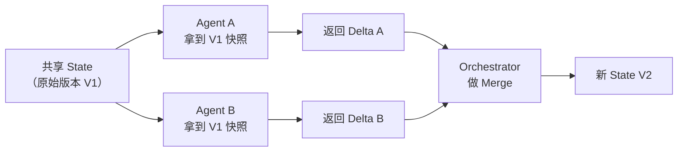

每个 Agent 拿到 State 的只读快照副本，执行完后返回变更增量（delta），orchestrator 负责合并。冲突时 orchestrator 裁决（可按优先级、时间戳或语义判断）。

**策略三：悲观锁（仅极端场景）**

当多个 Agent 必须写同一个字段时（如共同维护一个待办列表），才使用 mutex。但这本质上让并行退化为串行——如果频繁出现这种需求，说明你的任务拆分有问题。

**LangGraph 的做法**：

State 是 TypedDict，每个节点的返回值是 partial update，框架自动做 reducer merge（类似 Redux 的 reducer 模式）：

```text
Node A 返回: {"messages": [new_msg_a]}
Node B 返回: {"messages": [new_msg_b]}
Reducer（add_messages）: 自动合并为 {"messages": [...existing, new_msg_a, new_msg_b]}
```

**最佳实践**：设计 State Schema 时就避免写冲突——如果两个 Agent 需要写同一个字段，说明你的**任务拆分有问题**，应该回到架构设计层面解决，而不是在运行时用锁来补救。

**差距在哪**：面试官考的是对状态管理范式的理解——不是“加锁”那么简单，而是通过设计规避竞争。State 分片是最优解，COW 是次优解，加锁是最后手段。这和分布式系统中“shared-nothing 架构优于 shared-everything”是同一个原则。

---

## Q：如果拆成感知/推理/校验 Agent，哪些能并行哪些要顺序，什么时候需要反向通信？

> 来源：商汤/大模型算法应用实习二面

**新手答**：“顺序执行就好了，感知→推理→校验。”

**高手答**：

纯顺序执行是最简单但最慢的方案。实际系统中需要精确分析依赖关系，最大化并行度。

**并行性分析**：

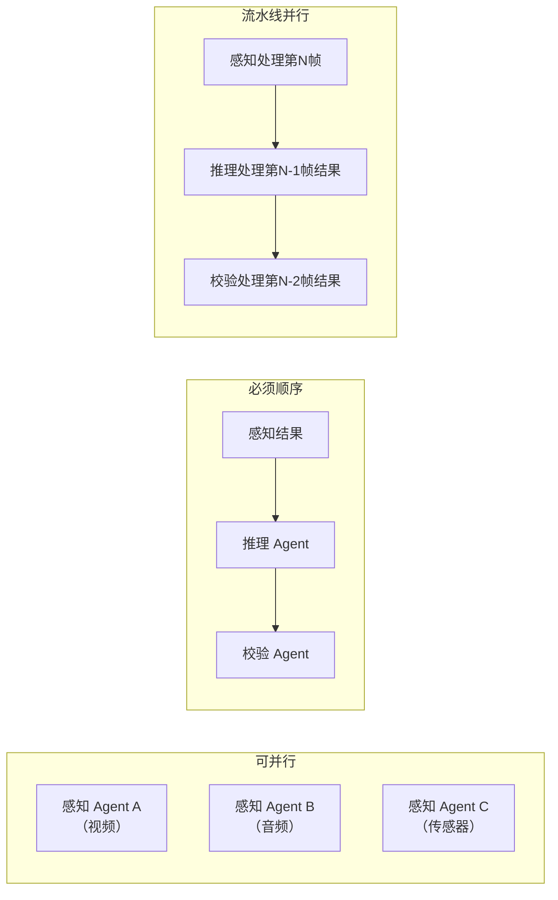

| 关系类型 | 具体场景 | 处理方式 |
|---------|---------|---------|
| 可并行 | 多个感知 Agent 同时处理不同模态数据 | Fan-out 并行，结果汇总后再进入推理 |
| 可并行 | 同一推理结果的多个校验维度（语法/语义/安全） | 校验 Agent 并行跑，结果合并 |
| 必须顺序 | 感知→推理（推理依赖感知结果） | 串行，上游完成才触发下游 |
| 必须顺序 | 推理→校验（校验需要推理输出） | 串行 |
| 可部分并行 | 流水线模式 | 感知处理第 N 帧时，推理可以处理第 N-1 帧 |

**反向通信场景**：

正向是感知→推理→校验，但三种情况需要**反向通知**：

| 反向通信 | 触发条件 | 处理方式 |
|---------|---------|---------|
| 校验→推理 | 校验失败，推理需要重新规划 | 反馈驱动的迭代：校验 Agent 把失败原因和修改建议回传推理 Agent |
| 推理→感知 | 推理发现信息不足，需要补充数据 | 主动探索：推理 Agent 告诉感知 Agent“需要重新采集 X 方面的数据” |
| 下游→上游 | 下游发现上游输出格式错误 | 上游修正并重发（通常只重试一次） |

**通信协议设计**：

用“事件总线”而非直接调用——解耦生产者和消费者，支持异步反向通知：

```text
正向事件：perception.completed → reasoning.started → verification.started
反向事件：verification.failed → reasoning.retry_requested
          reasoning.info_needed → perception.rescan_requested
```

**反向通信的终止条件**：设置最大反馈轮次（如 3 次），超过则降级处理——输出当前最优结果 + 置信度标注，不再循环。

**差距在哪**：面试官考的是对 DAG vs 循环图的理解，以及何时引入反馈环路的判断力。纯顺序暴露的是“没考虑过并行优化”，而盲目并行暴露的是“不理解数据依赖”。正确答案是精确分析依赖、最大化并行、有限反馈循环。

---

## Q：校验 Agent 和推理 Agent 结论冲突时怎么处理？

> 来源：商汤/大模型算法应用实习二面

**新手答**：“以校验 Agent 的结论为准。”

**高手答**：

不能简单“以谁为准”——需要根据**冲突类型**选择不同的仲裁策略。

**冲突分类与处理**：

| 冲突类型 | 特征 | 处理策略 | 示例 |
|---------|------|---------|------|
| 事实性冲突 | 校验 Agent 有外部证据 | 校验 Agent 赢，推理 Agent 重来 | 推理说“2024年GDP是X”，校验查到实际是Y |
| 逻辑性冲突 | 推理链有漏洞 | 让推理 Agent 补充推理步骤，校验再验证 | 推理跳过了某个前置条件的检查 |
| 不确定性冲突 | 双方都有道理 | 上升到仲裁层 | 对同一数据的不同合理解读 |

**工程实现——争议仲裁流程**：

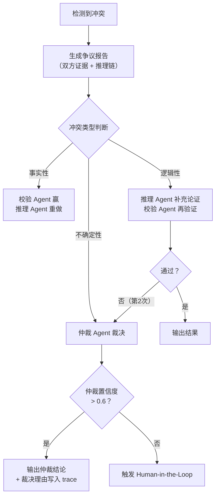

**争议报告结构**：

```text
{
  "conflict_type": "factual | logical | uncertain",
  "reasoning_agent_claim": "推理Agent的结论 + 推理链",
  "verification_agent_claim": "校验Agent的结论 + 证据来源",
  "overlap": "双方同意的部分",
  "disagreement": "具体分歧点"
}
```

**防止震荡**：推理 Agent 和校验 Agent 互相否定进入死循环时，设置**最大争议轮次**（通常 2-3 轮）后强制走仲裁。每一轮争议都必须产生新的证据或论点，如果第二轮的论点和第一轮相同，直接判定为“不确定性冲突”走仲裁。

**差距在哪**：面试官考的是多 Agent 系统中“冲突解决”机制的设计——这是分布式系统中的经典共识问题在 AI 领域的映射。简单“以谁为准”无法处理灰区情况，分类仲裁 + 争议报告 + 震荡防护才是完整方案。

---

## Q：在 A2A 场景下，如何防止两个 Agent 陷入递归对话？

> 来源：AI应用开发进阶面

**新手答**：“设置最大轮次限制。”

**高手答**：

最大轮次是必要的兜底，但只靠它意味着你允许系统白白浪费 N 轮资源后才停下来。需要更早发现和阻断递归。

**递归对话的成因**：Agent A 请求 Agent B 帮助 → B 发现需要 A 的信息 → 再问 A → A 又问 B... 本质是**分布式死锁**——两个节点互相等待对方提供信息。

**四层防递归机制**：

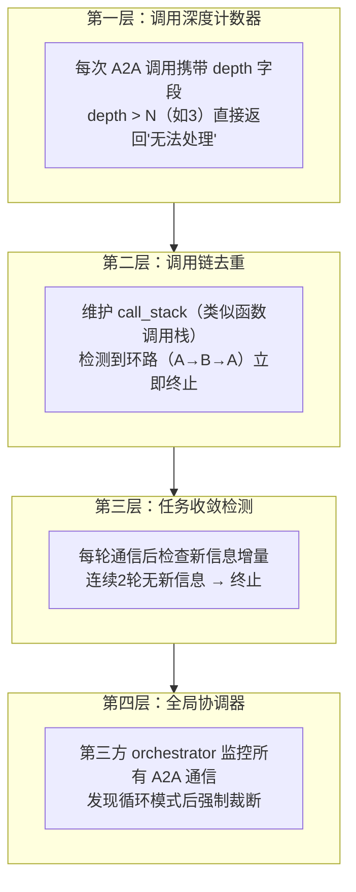

**各层详解**：

| 层级 | 机制 | 检测时机 | 成本 |
|------|------|---------|------|
| 调用深度计数器 | 每次调用 depth+1，超过阈值拒绝 | 发起调用前 | 零成本，一次判断 |
| 调用链去重 | 维护调用栈，检测 A→B→A 环路 | 发起调用前 | 栈查找，O(n) |
| 任务收敛检测 | 对比本轮和上轮的信息增量 | 收到响应后 | 语义对比，有计算成本 |
| 全局协调器 | 监控所有 Agent 间通信拓扑 | 持续监控 | 需要独立服务 |

**A2A 协议层支持**：

Google A2A 协议中，TaskState 的 `BLOCKED` 状态可以标记任务卡死。当一个 Task 在两个 Agent 之间反复流转超过阈值时，协议层自动将任务状态设为 `BLOCKED`，触发超时回收。

**根本解决——设计层面杜绝递归**：

在 Agent 的 system prompt 中明确约束：**“你不能向请求你的 Agent 发起反向请求”**。用 prompt 约束 + 协议层校验双重保险：

```text
System Prompt 约束：
  "当你收到来自其他 Agent 的请求时，你只能基于自己已有的能力和数据回答。
   如果信息不足，返回'信息不足，需要用户提供'，而不是向请求方反向提问。"

协议层校验：
  A2A 消息头中携带 origin_agent_id，
  如果目标 Agent 尝试向 origin_agent_id 发起新请求 → 直接拦截
```

**差距在哪**：面试官考的是对分布式系统死锁问题的理解——A2A 递归本质就是分布式死锁。只设最大轮次是“让死锁超时后自己断”，而调用链去重+收敛检测+prompt约束是“从根本上不让死锁发生”。前者浪费资源，后者预防问题。

---

## Q：业务模块增删时，如何治理 Multi-Agent 能力拓扑，避免 Agent 增殖和路由配置失控？

> 来源：懂车帝 / Agent 开发 / 一面

**新手答**：“按业务模块一个模块拆一个 Agent，新增模块就新增 Agent，删除时把配置删掉。”

**高手答**：

我的默认方案是先用单 Agent + Skill；只有一个候选单元同时满足下面多数条件，才升级成独立 Agent：

| 拆分判断 | 需要回答的问题 |
|---------|---------------|
| 独立目标与契约 | 能否定义稳定的输入、结构化输出和独立验收标准？ |
| 专用上下文 | 隔离领域知识后，是否能显著减少上下文污染？ |
| 工具与权限 | 是否需要不同工具集、数据域或最小权限边界？ |
| 并行收益 | 能否和其他任务并行，且汇总成本低于节省的时间？ |
| 评测与故障域 | 能否单独评测、限流、降级和回滚，而不拖垮整条链路？ |

例如代码审查可以有三个并行子 Agent，但不是复制三份相同配置：正确性 Agent 的 prompt 关注行为与测试，工具是测试运行器和代码检索；安全 Agent 关注攻击面与数据流，工具是 SAST、依赖扫描和密钥检测；可维护性 Agent 关注复杂度与规范，工具是 lint、类型检查和 diff 分析。三者只返回统一的 `finding_id、位置、严重级别、证据、置信度、修复建议`，不直接写代码。

Supervisor 汇总时先按位置和根因去重，再执行确定性优先级：合规硬门禁和已证实的高危安全问题优先，其次是正确性、影响范围、证据质量和置信度，最后才是风格建议。规则无法裁决的语义冲突才交给模型仲裁；低置信度冲突进入人工复核，并在 trace 中保留少数意见，不能用一段总结把分歧抹掉。

防止 Agent 随业务线无限增殖，关键是把能力与模块解耦：维护带 owner、版本、输入输出 schema、工具权限、SLO 和生命周期状态的能力注册表；拓扑、router 和 prompt 引用同一份版本化配置。新增模块先复用已有能力，确需新增时经过离线路由评测、shadow 流量和小流量发布；删除模块则先标记 `deprecated`、停止接收新任务、排空在途任务，再删除路由，并保留可回滚版本。

我会持续看路由 Top-1 准确率、handoff 率、冲突率、单任务活跃 Agent 数、上下文 token、成功率和回退率。典型失败信号包括孤儿路由仍指向已删除 Agent、prompt 与工具版本错配、低价值 handoff 激增，以及新增 Agent 后成功率不升反降；出现这些信号就回滚拓扑，而不是继续补 Agent。

**差距在哪**：新手把组织架构或代码模块直接映射成 Agent。高手以契约、权限、上下文、并行收益和独立故障域决定粒度，用注册表和版本化拓扑管理增删，并能说明不同子 Agent 的 prompt、工具和验收标准，以及 Supervisor 如何基于证据稳定裁决冲突。

---

## Q：大规模 Multi-Agent 如何做调度、背压和资源隔离？调度器崩溃或 Leader 派错任务时怎么恢复？

> 来源：深信服 / Agent 开发 / 一面；钉学科技 / FDE 实习 / 一面

**新手答**：“开线程池限制并发，失败就重试，调度器重启后接着跑。”

**高手答**：

第一步是让系统有明确的容量边界。入口做 admission control，设置全局、租户和任务三级并发预算；每个子任务按预计 token、工具连接数或 GPU 占用领取加权 semaphore，而不是把所有 Agent 当成等价请求。队列必须有界，按业务优先级加权公平调度，并为 LLM Provider、数据库、浏览器和 GPU 建独立资源池，防止一种慢资源耗尽全部槽位。

背压不能只看“当前并发数”。我会同时监控队列深度、最老任务等待时间、P95/P99 延迟、token/请求速率、Provider quota，以及 CPU、内存、连接池和 GPU 饱和度。任一指标越过分级阈值时，依次采取延迟低优先级任务、减少 fan-out、切换轻量模型或缓存结果、返回 `Retry-After`，最后拒绝新任务；所有重试使用指数退避加抖动和全链路 retry budget，避免下游故障触发重试风暴。

Leader 派活前从能力注册表筛选满足输入 schema、工具权限、健康状态和剩余预算的 Agent，并记录路由置信度。派错时，子 Agent 应以结构化 `capability_rejected` 尽早拒绝；Leader 最多重新路由一次，仍失败就走通用 fallback 或人工升级。错误路由、候选集合和最终结果都回灌 badcase 评测集，重点跟踪路由准确率、拒绝率、重复 handoff 率和纠偏成功率，不能让 Agent 之间无限转派。

调度器崩溃恢复依赖持久化状态，而不是进程内存：

| 机制 | 具体决策 | 防止的故障 |
|------|---------|-----------|
| 持久任务账本 | 保存 `task_id`、DAG 版本、状态、依赖、尝试次数和 checkpoint | 重启后不知道任务做到哪一步 |
| 租约与心跳 | Worker 领取有限期 lease，超时后任务才可被重新领取 | Worker 失联导致任务永久卡住 |
| 幂等键与 checkpoint | 副作用调用携带 idempotency key，长任务按阶段落盘 | 重放造成重复扣款、重复写入或整步重算 |
| fencing token | 新 lease 的单调递增 token 高于旧 Worker | 旧 Worker 恢复后用过期结果覆盖新结果 |
| 重试预算与死信队列 | 区分瞬时错误和永久错误，达到上限进入 DLQ | 无限重试耗尽容量 |
| 对账与回放 | 新调度器扫描无有效 lease 的 `RUNNING` 任务，从最近 checkpoint 重放 | 崩溃窗口内的状态遗漏 |

调度器本身做无状态多副本，任务状态放在具备条件更新能力的存储中。恢复后不能承诺虚假的 exactly-once，而是用 at-least-once 调度 + 幂等副作用实现业务上的一次效果。验收至少覆盖任务成功率、排队时间、资源利用率、超时率、重试放大系数、恢复时间 RTO 和重复副作用数；重点压测配额耗尽、热点租户挤占、调度器在 checkpoint 前后崩溃、旧 Worker 迟到回写等故障。

**差距在哪**：新手把大规模调度等同于线程池和无限重试。高手会给并发预算、资源池、背压信号和公平策略设明确边界，也能用能力拒绝与有限重路由纠正错分配，并通过任务账本、租约、幂等、fencing token、checkpoint 和死信队列让调度器崩溃后可恢复、可对账。

---

## 这类题的答题模式

多智能体协作题的核心是**系统设计思维**：

```text
1. 角色必须隔离——职责不交叉，输出格式固定
2. 通信必须结构化——JSON 消息体，带 task_id，方便追踪
3. 协作拓扑按场景选——顺序链、分治、多轮对话各有适用场景
4. 冲突必须有收敛机制——仲裁者、轮次限制、人工升级
5. 共享状态用黑板模式——读写隔离、事件驱动、版本控制
```

面试官听到“写完发给另一个看”就知道你只跑过 Demo。听到角色隔离、结构化通信、状态机编排、黑板模式，才会觉得你做过需要多组件协作的真实系统。

下一篇建议继续看：

- [工程化踩坑：死循环、状态丢失与成本控制](../07-engineering-pitfalls/index.html)
