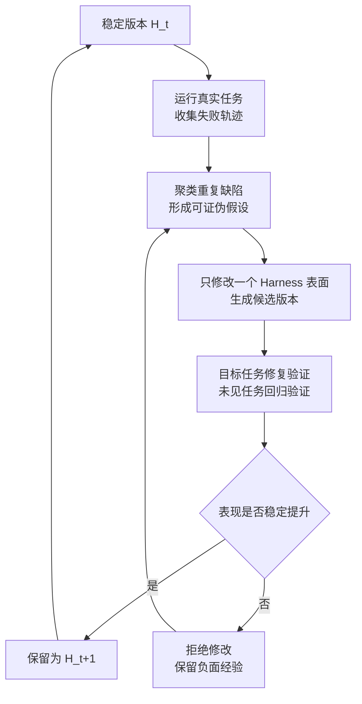

# Auto Harness 实战：从失败轨迹迭代 Agent 运行骨架

Agent 能连续运行六小时、自动压缩历史、失败后自行重试，并不等于 Auto Harness。它可能只是同一套运行骨架跑得更久，或者在一次会话里临时改变上下文。

真正值得研究的问题是：**当 Agent 反复暴露同一类缺陷时，系统能否把失败变成一个小而明确的 Harness 修改，并验证下一版确实更好。** 这篇文章不讨论怎样增加更多管理流程，而是聚焦 `H_t -> H_t+1` 这一轮迭代怎样发生。

## 一、Auto Harness 迭代的到底是什么

可以把一个 Agent 写成：

```text
Agent A = 固定模型 M + 运行骨架 H
```

这里的 `H` 是模型之外、决定 Agent 如何工作的全部非参数化机制：

- System Prompt、上下文选择和压缩策略
- 工具定义、参数 Schema、解析器和适配器
- 规划、路由、重试、恢复和退出条件
- 记忆、检索、验证器、权限与资源限制

Auto Harness 固定基础模型 `M`，根据运行证据修改 `H`。如果模型权重变了，那是训练；如果只更新当前会话摘要，那是 Context Adaptation；如果 Prompt、工具或控制流形成了可持久化的新版本，并通过新任务验证，才是 Harness 迭代。

| 场景 | 改变对象 | 是否产生新 Harness | 判断 |
|------|---------|-------------------|------|
| 自动总结历史 | 当前会话上下文 | 否 | Context Adaptation |
| 人工修改 Skill | 持久化规则 | 是 | 人工 Harness 迭代 |
| Agent 提议并验证 Prompt Diff | 持久化规则 | 是 | Auto Harness 的基础形态 |
| 在线任意修改工具和权限 | 整套运行环境 | 是 | 风险过高，不适合作为起点 |

核心区别不在“是不是 Agent 写的”，而在于有没有形成一个可比较的新版本。

## 二、研究给出的共同主线

[OpenAI 的 Harness Engineering 实践](https://openai.com/index/harness-engineering/)强调先把仓库知识、工具、测试和环境变得对 Agent 可读、可执行。它解决的是怎样得到一套可靠 Harness，是后续自动迭代的地基。

[AutoHarness](https://arxiv.org/abs/2603.03329v1)进一步把 Harness 当作代码搜索空间：模型根据游戏环境反馈迭代动作验证器或代码策略。它证明 Harness 不必停留在人工 Prompt，但实验集中在规则清楚、反馈可验证的 TextArena 游戏，不能直接外推到开放式软件工程。

[Self-Harness](https://arxiv.org/abs/2606.09498v1)把迭代压缩成三个动作：从多条轨迹挖掘重复弱点，围绕弱点提出小而多样的修改，再用未参与提议的任务做回归验证。这比“失败后再加一句 Prompt”更接近可复用改进。

[HarnessBank](https://arxiv.org/abs/2607.13683v2)继续补充了两个有用判断：新增机制必须在运行中真正触发，收益还要越过随机波动。与此同时，[Harness 演化评测研究](https://arxiv.org/abs/2607.12227v1)发现，匹配反馈和推理预算后，部分 Harness 演化并不稳定优于普通重试，跨任务泛化也有限。

这些工作虽然方法不同，但都绕不开同一条主线：

```text
运行证据 -> 重复缺陷 -> 最小修改 -> 对照验证 -> 保留或拒绝
```

## 三、一轮 Harness 迭代怎样发生



这不是一次“大升级”，而是一连串小实验。每轮只回答一个问题：**某个明确的 Harness 缺口，是否能被一个最小修改稳定修复？**

## 四、第一步：把失败变成可用证据

完整聊天记录通常太长，也混有大量无关内容。Harness 迭代真正需要的是一份紧凑的失败记录：

```yaml
task_id: fix-api-timeout
harness_version: h-2026-08-01
outcome: failed
failure_stage: verification
last_valid_state: implementation_complete
tool: pytest
error_class: test_timeout
exit_reason: retry_budget_exhausted
cost_tokens: 18420
latency_seconds: 366
```

记录的目的不是归档一切，而是支持横向比较：同一版本是否在不同任务里反复停在验证阶段？某个工具是否经常参数错误？Agent 是否总在还有重试预算时提前结束？

先排除环境噪声。沙箱崩溃、依赖源不可用、验证器超时属于环境失败；一次随机推理错误也不足以修改共享 Harness。只有在多个独立任务上重复出现、并能定位到 Harness 行为的缺陷，才值得进入下一轮。

## 五、第二步：从失败簇提出最小修改

假设最近 30 次编码任务中，有 8 次在测试失败后直接结束。轨迹显示模型已经看到错误，但恢复流没有明确要求重新读取失败摘要。此时的候选不该是“重写整个 Coding Agent”，而应是一份很小的修改：

```yaml
candidate_id: recovery-read-test-summary
parent: h-2026-08-01
hypothesis: 恢复流遗漏测试摘要导致 Agent 过早结束
changed_surface: workflows/recovery.yaml
expected_activation: test_failed and retry_budget_remaining
expected_effect: 降低可恢复测试失败造成的任务失败率
non_goals:
  - 不修改测试命令
  - 不增加重试预算
  - 不扩大工具权限
```

好的候选包含四件事：

1. **失败机制**：为什么当前 Harness 会失败。
2. **最小 Diff**：只改一个 Prompt、工具描述或控制条件。
3. **触发条件**：新机制应该在哪些轨迹中执行。
4. **预期变化**：什么指标会改善，什么行为必须保持不变。

这使候选可证伪。如果新恢复规则从未触发，即使平均分偶然提高，也不能把收益归因于它。

## 六、第三步：比较新旧版本，而不是证明候选能跑

验证至少回答两个问题：

- **目标问题修好了吗？** 在触发该缺陷的任务上比较 `H_t` 与候选版本。
- **原有能力退化了吗？** 在提议阶段未见的任务上检查回归。

| 固定条件 | 需要观察的变化 |
|---------|---------------|
| 相同基础模型与推理参数 | 任务成功率、错误类型 |
| 相同任务与验证器 | 新机制是否触发 |
| 相同 Token 和重试预算 | 成本、时延、工具调用数 |
| 多次独立运行 | 均值、波动和失败分布 |

还要加入一个朴素基线：固定旧 Harness，只增加相同预算的并行采样或顺序重试。如果候选不比这个基线更好，所谓“迭代收益”可能只是多花了计算量。

通过验证后，候选成为 `H_t+1`，同时保留父版本和修改原因；失败候选也值得记录成负面经验，避免下一轮重复提出同一种无效规则。这里不需要复杂平台，Git Commit 加一份结构化评估结果就能起步。

## 七、应该先开放哪些可变表面

Auto Harness 的搜索空间越大，越难归因。建议按风险从低到高逐步开放：

| 可变表面 | 适合解决的问题 | 验证重点 |
|---------|---------------|---------|
| Prompt / Skill | 步骤遗漏、输出约束不清 | 指令冲突、长度膨胀 |
| 上下文策略 | 关键文件漏读、无关内容过多 | 召回率、Token 成本 |
| 工具描述 / Schema | 工具选错、参数格式错误 | 契约兼容、非法调用 |
| 控制流 | 提前结束、无效重复、恢复失败 | 步数、退出原因、成本 |
| 记忆与检索 | 重复犯错、经验无法复用 | 污染、过期、隐私 |

第一版只优化 Prompt 或一个 Skill。等单组件迭代稳定后，再开放工具 Schema 或恢复策略。权限、安全策略和最终评估器不应由候选自动修改，否则系统会通过放宽约束来制造“提升”。

## 八、结合我们的工程实践看 Harness 怎样迭代

我们已经做过很多人工驱动的 Harness 迭代。它们的共同点不是增加项目管理，而是把重复失败变成更好的 Agent 运行条件：

| 观察到的重复问题 | 修改的 Harness 工件 | 迭代结果 |
|-----------------|-------------------|---------|
| Agent 进入错误仓库或遗漏项目约束 | 根 `AGENTS.md` 只提供地图，再按项目加载规则 | 初始上下文更小、更准确 |
| 多个任务在同一工作区互相污染 | 为独立任务使用隔离 Worktree | Diff、测试和回滚互不干扰 |
| 同一类任务反复解释相同步骤 | 把稳定方法提炼为窄范围 Skill | 后续运行直接复用已验证方法 |
| 外部 Push、PR 或评论容易越过人的判断 | 把外部动作设为明确授权点 | Agent 可自主完成本地工作，外部影响仍可控 |
| 简单文章图也默认走 Draw.io，导出成本高 | 改为 Mermaid 默认，Draw.io 仅作例外 | 图表迭代直接留在 Markdown 中完成 |

最后一行就是本次真实迭代。我们先观察到默认 Draw.io 与实际写作偏好不一致，再定位到根 `AGENTS.md` 和 `new-article` Skill 中两处旧规则，只修改这两个 Harness 工件，并在本篇文章中直接使用 Mermaid 验证新规则。

这仍然是**人工 Harness 迭代**：人发现问题、给出方向并决定是否保留。向 Auto Harness 再走一步，不是增加更多表单，而是让系统从已有运行证据中自动完成两件事：发现高频失效模式，生成可审查的最小 Diff。

## 九、最小可行的 Auto Harness 原型

第一版不需要让 Agent 自动改线上系统。它只需要离线生成候选和对比报告：

```python
def iterate_harness(current, recent_runs, target_tasks, regression_tasks):
    failures = top_repeated_failures(recent_runs)

    for hypothesis in propose_hypotheses(failures):
        patch = propose_minimal_patch(current, hypothesis)
        if not patch.touches_only("prompts", "skills"):
            continue

        candidate = current.apply(patch)
        target = compare(current, candidate, target_tasks)
        regression = compare(current, candidate, regression_tasks)

        if target.improves and regression.no_degradation:
            return reviewable_candidate(patch, target, regression)

    return None
```

工程落地可以分三步：

1. **人工迭代，统一证据**：给 Harness 加版本号，保存紧凑轨迹，人工提出小 Diff。
2. **自动提议，人工保留**：Agent 聚类失败并生成候选，人 Review 后决定是否合入。
3. **自动离线筛选**：低风险候选在隔离任务集上自动比较，只把通过者交给人。

到第三步已经能显著减少 Harness 维护成本。在线自动修改、自动放宽权限或自动全量发布，并不是证明 Auto Harness 有价值的必要条件。

## 十、少量但必要的边界

边界的作用是保护迭代信号，不是增加流程：

- 评估器不能和候选一起改，否则分数失去可比性。
- 用于提议的任务与回归任务要分开，避免把记住测试集当成改进。
- 随机模型要重复运行，不能用一次变绿证明收益。
- 权限扩大和外部副作用继续由人决定。
- 每个新版本保留父版本，出现退化可以立即回退。

## 十一、研究脉络：不同方法在迭代哪一层

| 工作 | 主要迭代对象 | 可以借鉴什么 | 边界 |
|------|-------------|-------------|------|
| [Harness Engineering](https://openai.com/index/harness-engineering/) | 仓库、工具、规则和反馈环境 | 让 Agent 能读、能做、能验证 | 工程实践，不是自动搜索算法 |
| [ADAS](https://arxiv.org/abs/2408.08435v2) | Agentic System 代码结构 | 用 Meta Agent 搜索系统设计 | 搜索空间大、评估昂贵 |
| [GEPA](https://arxiv.org/abs/2507.19457v2) | 一个或多个 Prompt | 从轨迹反思并演化规则 | 主要覆盖 Prompt 层 |
| [AutoHarness](https://arxiv.org/abs/2603.03329v1) | 动作验证器或代码策略 | 把 Harness 作为程序搜索 | 证据集中在规则明确的游戏 |
| [Self-Harness](https://arxiv.org/abs/2606.09498v1) | 模型特定 Harness | 失败聚类、最小候选、回归验证 | 仍需更多生产验证 |
| [HarnessBank](https://arxiv.org/abs/2607.13683v2) | 多种 Harness 机制 | 激活检查、显著性筛选、保留多样候选 | 预印本结果需独立复现 |
| [Harness Evolution Evaluation](https://arxiv.org/abs/2607.12227v1) | 评测方法 | 匹配预算、加入简单基线、检查泛化 | 说明当前收益并不总是稳定 |

## 小结

- **Auto Harness 不是让 Agent 跑更久，而是让运行骨架形成新版本。**
- **一轮迭代从重复失败开始，以一个最小、可证伪的 Harness Diff 为单位。**
- **目标任务验证修复，未见任务保护原有能力，相同预算基线排除“多试几次”的收益。**
- **我们现有实践已经在人工迭代 Harness；下一步是自动发现失败簇并生成小 Diff，而不是增加管理流程。**
- **从 Prompt 和 Skill 开始，等单组件迭代稳定后再扩大搜索空间。**

下一篇建议继续看：

- [Agent 训练环境工程：从仿真沙箱到数据回流闭环](../../learn-agent-training/07-training-environment-engineering/index.html)——为 Harness 迭代补齐可复现执行、评估和数据回流环境
