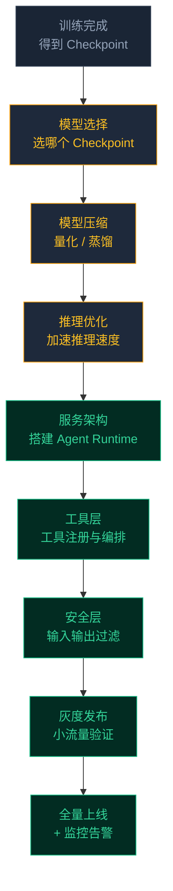

# 从 SFT 到部署：Agent 模型上线全流程

前面几篇讲了 SFT、RL、数据配比、评测——模型训练完了，评测指标也达标了。然后呢？

从“训练好的模型权重”到“线上稳定运行的 Agent 服务”之间，还有一段不短的路。这段路涉及模型压缩、推理优化、服务架构、工具编排、监控告警、灰度发布等工程问题。很多团队在训练阶段投入了大量资源，但在部署阶段踩的坑反而更多。

本篇走一遍从训练到上线的完整流程，重点讲每个环节的关键决策和常见踩坑。

## 全流程概览



下面逐个环节展开。

## 1. 模型选择：不一定是最后一个 Checkpoint

训练过程中会保存多个 checkpoint。最终用哪一个，不是简单地选“最后一步”或“Reward 最高的”。

```text
Checkpoint 选择的考量维度：
├── Agent 任务完成率       ← 核心指标
├── 通用 benchmark 分数    ← 确保通用能力没崩
├── 工具调用格式正确率     ← 格式崩了上线就是灾难
├── 安全评测得分           ← 安全是硬约束
└── 推理效率（平均步骤数）  ← 影响线上延迟和成本
```

**常见的选择策略**：

| 策略 | 做法 | 适用场景 |
|---|---|---|
| 综合最优 | 五个维度加权打分，选总分最高的 | 通用场景，默认选择 |
| 安全优先 | 在安全评测通过的 checkpoint 里选 Agent 最强的 | 高风险场景（金融、医疗） |
| 效率优先 | 在完成率达标的 checkpoint 里选步骤数最少的 | 对延迟敏感的场景 |
| 集成多个 | 不同 checkpoint 处理不同类型的任务（路由分发） | 任务类型差异大的场景 |

**一个反直觉的经验**：RL 训练后期的 checkpoint 往往 Reward 最高，但不一定是最好的上线选择——它可能过拟合到训练任务分布上，在分布外的任务上反而退化。中期的某个 checkpoint 可能综合表现更好。

## 2. 模型压缩：让模型跑得起来

训练时用的 FP16/BF16 模型直接上线，推理成本通常太高。需要做模型压缩。

### 量化：最主流的压缩方式

```text
常见量化方案对比：

FP16（不量化）  显存 100%  精度 100%  适用：不差钱
INT8            显存 ~50%   精度 ~99%  适用：大多数场景的默认选择
INT4 (GPTQ)    显存 ~25%   精度 ~95%  适用：显存紧张、对精度容忍度高
INT4 (AWQ)     显存 ~25%   精度 ~96%  适用：同上，通常比 GPTQ 好一点
FP8             显存 ~50%   精度 ~99.5% 适用：H100+ 硬件支持 FP8
```

**Agent 场景量化的特殊注意点**：

普通对话模型量化后精度下降 1-2% 通常可以接受。但 Agent 模型的量化需要特别注意**工具调用格式**——tool call 的 JSON 格式对 token 精度敏感，量化后可能出现：

```text
量化前：{"name": "get_weather", "arguments": {"city": "北京"}}
量化后：{"name": "get_weather", "arguments": {"city": "北京"}   ← 少了闭合大括号
量化后：{"name": "get_weathr", "arguments": {"city": "北京"}}  ← 函数名拼错
```

**验证方法**：量化后必须跑一轮完整的 Agent 评测，不能只看 perplexity 或通用 benchmark。重点看：
- 工具调用 JSON 格式正确率（下降超过 2% 就要警惕）
- 参数填充准确率
- 复杂轨迹（8+ 步）的完成率

### 蒸馏：用小模型逼近大模型

如果大模型太贵但训练数据充足，可以考虑蒸馏——用大模型（teacher）生成大量高质量轨迹，训练小模型（student）。

```text
Agent 蒸馏的典型流程：
├── Teacher（70B）在沙箱中跑大量任务，生成轨迹
├── 筛选成功轨迹，作为 Student 的训练数据
├── Student（7B-13B）用这些轨迹做 SFT
├── 可选：再对 Student 做 RL 微调
└── 结果：7B 模型达到 70B 模型 70-85% 的 Agent 能力

适用场景：
├── 线上推理成本是硬约束
├── 延迟要求严格（<2 秒端到端）
└── 部署环境 GPU 有限
```

蒸馏的效果天花板取决于 Teacher 的质量——Teacher 在某类任务上表现差，Student 在这类任务上也不会好。

## 3. 推理优化：Agent 对延迟更敏感

Agent 的端到端延迟 = 模型推理延迟 × 步骤数 + 工具调用延迟 × 步骤数。一个 8 步的任务，每步推理 2 秒、工具调用 1 秒，端到端就是 24 秒。用户是不会等 24 秒的。

### 关键优化手段

**KV Cache 优化**

Agent 轨迹的一个特点是：上下文会不断增长（每一步的工具调用和返回都会追加到上下文中），但前面的内容不会变。KV Cache 可以避免重复计算已有上下文的注意力。

```text
Agent 轨迹的 KV Cache 特点：
├── 上下文增长模式：单调递增（每步追加几百到上千 tokens）
├── 缓存命中率高：每一步只有新增部分需要计算
├── 显存压力大：8 步之后上下文可能到 8K+ tokens
└── 需要管理：多个并发请求的 KV Cache 显存争抢
```

**推理并行化**

Agent 执行中有些工具调用是可以并行的——比如同时查天气和查航班，不需要等天气结果再查航班。

```text
串行执行（默认）：
  查天气(2s) → 查航班(2s) → 查酒店(2s) → 总结 = 6s + 推理时间

并行执行（优化后）：
  查天气(2s) ─┐
  查航班(2s) ─┼→ 总结 = 2s + 推理时间
  查酒店(2s) ─┘
```

实现并行工具调用有两种方式：
- **模型原生支持**：训练时就教模型输出多个并行的 tool call
- **系统层面调度**：模型输出多个 tool call 后，系统并行执行

### 推理框架选型

| 框架 | 特点 | 适合场景 |
|---|---|---|
| vLLM | PagedAttention，高吞吐，社区活跃 | 大多数场景的默认选择 |
| TensorRT-LLM | NVIDIA 官方，极致性能 | 追求最低延迟、NVIDIA GPU |
| SGLang | 支持结构化生成，对 tool call JSON 友好 | Agent 场景特别推荐 |
| Ollama | 简单部署，适合小模型 | 原型验证、小规模部署 |

**Agent 场景的特殊需求**：推理框架需要支持**结构化输出**（Structured Output / JSON Mode），确保模型输出的 tool call 是合法的 JSON。否则需要在应用层做格式修复，增加复杂度和延迟。

## 4. 服务架构：Agent Runtime

模型是 Agent 的大脑，但还需要一整套 Runtime 来协调模型和工具之间的交互。

```text
Agent Runtime 的核心职责：
├── 对话管理    维护多轮对话状态、上下文拼接
├── 工具调度    解析 tool call → 路由到对应工具 → 收集返回
├── 循环控制    判断什么时候继续调模型、什么时候结束
├── 错误处理    工具超时/报错的重试和降级
├── 并发管理    多用户同时使用的资源隔离
└── 日志记录    完整轨迹记录，用于后续分析和训练
```

### 一个典型请求的完整链路

```text
用户请求
  ↓
API Gateway（鉴权、限流）
  ↓
Agent Runtime
  ├── 1. 拼接上下文（system prompt + 历史 + 用户消息）
  ├── 2. 调用模型推理
  ├── 3. 解析模型输出
  │   ├── 如果是 tool_call → 转 4
  │   └── 如果是文本回复 → 转 6
  ├── 4. 执行工具调用（安全检查 → 调用 → 获取返回）
  ├── 5. 把工具返回追加到上下文，回到 2
  ├── 6. 返回最终回复给用户
  └── 7. 异步写入日志
```

### 循环控制：防止 Agent 跑飞

必须设置硬性的循环限制，防止 Agent 进入无限循环：

```text
必须设置的限制：
├── 最大步骤数    通常 15-20 步，超过强制终止并返回当前结果
├── 最大 Token 数  防止上下文无限增长，通常设在模型窗口的 80%
├── 单步超时      每次工具调用的超时时间，通常 30-60 秒
├── 总超时        整个请求的总耗时限制，通常 2-5 分钟
└── 重复检测      连续 N 次调用相同工具+相同参数，判定为循环
```

没有这些限制的 Agent 上线 = 等着出事故。模型偶尔会进入死循环（比如工具返回的结果不符合预期，模型反复重试同样的调用），没有硬限制就会一直跑下去，消耗大量资源。

## 5. 工具层：注册、鉴权、编排

Agent 的工具不是直接暴露给模型的——中间需要一层管理。

### 工具注册与版本管理

```text
工具注册信息：
├── 工具名称和描述（给模型看的）
├── 参数 schema（JSON Schema 格式）
├── 端点地址（工具服务的 URL）
├── 鉴权方式（API Key / OAuth / 内部 RPC）
├── 超时设置
├── 限流规则（QPS 限制）
├── 版本号
└── 是否启用（灰度控制用）
```

**版本管理的重要性**：工具的接口变更（新增参数、返回格式变化）会直接影响 Agent 的行为。如果工具升级了但 Agent 模型还在用旧的 schema 调用，就会出错。

```text
安全的工具升级流程：
├── 新版本工具和旧版本并行部署
├── 灰度切流量到新版本
├── 监控 Agent 在新工具上的调用成功率
├── 确认无问题后下线旧版本
└── 如果模型需要重新训练才能适配新接口 → 先训练再切
```

### 参数校验与补全

模型输出的 tool call 参数可能有小瑕疵——类型不匹配、缺少可选参数、格式略有偏差。在工具层做一层轻量的校验和补全，可以减少工具调用失败：

```text
参数校验层的职责：
├── 类型转换    模型输出 "123" 但参数类型是 int → 自动转换
├── 默认值补全  可选参数没填 → 用 schema 中的默认值
├── 格式修复    日期格式 "2024/3/15" → "2024-03-15"
├── 越界检查    参数值超出合法范围 → 返回错误信息让模型重试
└── 注入防护    参数内容包含潜在注入攻击 → 清洗或拒绝
```

## 6. 安全层：上线前的最后一道关

Agent 安全不能只靠训练阶段的安全数据——需要在系统层面加硬约束。

### 输入过滤

```text
用户输入到达 Agent 之前：
├── Prompt 注入检测    检测用户输入中是否包含指令注入
├── 敏感信息检测       PII（个人身份信息）过滤
├── 频率限制           单用户请求频率限制
└── 内容分类           识别并标记高风险请求
```

### 输出过滤

```text
Agent 回复返回用户之前：
├── 工具调用合法性检查  调用的工具是否在允许列表中
├── 参数安全检查       参数是否包含危险操作（rm -rf、DROP TABLE 等）
├── 返回内容过滤       过滤掉不该暴露给用户的系统信息
└── 敏感信息脱敏       工具返回中的敏感信息自动脱敏
```

### 操作确认机制

对高危操作，系统层面强制要求用户确认：

```text
高危操作白名单 / 黑名单：

黑名单（绝对不允许，系统层面拦截）：
├── 删除系统文件
├── 执行未知来源的代码
└── 发送大量外部请求

需确认（可以执行，但必须用户确认）：
├── 删除用户文件
├── 发送邮件/消息
├── 修改数据库记录
└── 支付操作

白名单（直接执行，不需确认）：
├── 查询操作（只读）
├── 信息检索
└── 文本生成
```

## 7. 灰度发布与监控

模型不是一次性全量上线的——需要灰度。

### 灰度策略

```text
推荐的灰度流程：

第 1 天：内部测试（团队内部使用）
  └── 重点验证基本功能、关键路径

第 2-3 天：1% 流量
  └── 监控错误率、完成率、延迟

第 4-7 天：5-10% 流量
  └── 对比新旧模型的 A/B 指标

第 2 周：30-50% 流量
  └── 观察长尾 case 和边界场景

第 3 周：100% 流量
  └── 保留旧模型 1 周作为回滚备份
```

### 线上监控指标

```text
必须监控（P0，告警阈值严格）：
├── 请求成功率              < 95% 立即告警
├── 工具调用格式正确率      < 98% 立即告警
├── 循环终止率              > 5% 立即告警（Agent 跑飞了）
├── 端到端延迟 P99          超过 SLA 告警
└── 安全拦截率              突然升高说明模型行为异常

重点关注（P1，每日检查）：
├── 任务完成率（按类型分）  和离线评测对比
├── 平均步骤数              上升说明效率退化
├── Token 消耗 / 请求       上升说明推理成本增加
├── 用户反馈（好评/差评率）  最直接的质量信号
└── 工具调用分布            某个工具调用突增/骤降要排查

定期分析（P2，每周 review）：
├── 失败轨迹分析            分类失败原因，指导下一轮训练
├── 高 token 消耗轨迹分析   找到效率瓶颈
├── 新出现的 pattern         用户使用方式的变化
└── 安全事件回顾            安全层拦截的具体案例
```

### 回滚方案

上线后发现严重问题，需要能快速回滚：

```text
回滚准备：
├── 旧模型保持在线至少 1 周，随时可以切回
├── 回滚操作必须在 5 分钟内完成
├── 回滚后自动触发告警通知，通知团队分析原因
└── 回滚不影响用户的对话状态（上下文保留）
```

## 完整 Checklist：上线前的检查清单

把所有环节串起来，上线前必须过一遍这个 checklist：

```text
模型层面：
├── [ ] Checkpoint 选择有明确依据（评测报告）
├── [ ] 量化后 Agent 评测指标下降 < 3%
├── [ ] 工具调用格式正确率 > 98%
├── [ ] 安全评测通过（拒绝率 > 95%）
├── [ ] 长文本场景（8K+）测试通过

推理层面：
├── [ ] 推理框架部署完成，压力测试通过
├── [ ] 结构化输出功能验证
├── [ ] KV Cache 管理策略确认
├── [ ] GPU 资源和自动扩缩容配置

服务层面：
├── [ ] Agent Runtime 部署完成
├── [ ] 循环限制配置（最大步骤数、总超时）
├── [ ] 工具注册和鉴权配置
├── [ ] 参数校验层部署

安全层面：
├── [ ] 输入过滤规则配置
├── [ ] 输出过滤规则配置
├── [ ] 高危操作确认机制配置
├── [ ] 安全日志记录开启

发布层面：
├── [ ] 灰度方案确定
├── [ ] 监控告警配置
├── [ ] 回滚方案验证
├── [ ] 旧模型保持可用
└── [ ] 值班人员安排
```

## 小结

- 模型选择不是选最后一个 checkpoint——要综合看完成率、通用能力、格式正确率、安全和效率
- 量化后必须重新跑 Agent 评测，特别关注工具调用 JSON 格式是否受损
- Agent 对延迟更敏感（延迟 × 步骤数 = 用户等待时间），KV Cache 优化和工具并行调用是关键
- 服务架构必须有循环控制硬限制——没有限制的 Agent 上线 = 等着出事故
- 安全不能只靠模型训练，需要系统层面的输入输出过滤和操作确认机制
- 灰度发布 + 线上监控 + 快速回滚是三件套，缺一不可

下一篇建议继续看：

- [Agent 训练环境工程：从仿真沙箱到数据回流闭环](../07-training-environment-engineering/index.html)：补齐算法之外的沙箱、评估和数据回流工程
