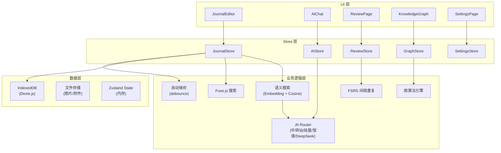

# 学习日记 App — 系统架构设计分析

> 分析日期：2026-08-02
> 目标：为后续代码编写提供完整的架构设计指导

---

## 1. 用户故事驱动的架构分析

### 1.1 核心用户故事

```
作为 学习者
我希望 快速记录今天学到的知识点
以便 日后复习回顾
```

```
作为 自学者
我希望 AI 能帮我总结笔记、生成复习卡片
以便 提高学习效率
```

```
作为 编程学习者
我希望 把代码片段和学习笔记关联起来
以便 建立完整的知识体系
```

### 1.2 从用户故事推导系统边界

```
用户界面层（UI）
  ├── 日记输入 → Markdown 编辑器 + 快捷操作
  ├── 知识回顾 → 卡片翻转 + 图谱浏览
  ├── AI 交互  → 对话面板 + 一键操作按钮
  └── 数据管理 → 设置页 + 导入导出

业务逻辑层（Logic）
  ├── 日记管理 → CRUD + 自动保存 + 版本追踪
  ├── AI 服务  → 多 Provider 路由 + Prompt 管理 + 流式响应
  ├── 知识管理 → 概念提取 + 关联推理 + 图谱构建
  ├── 复习系统 → FSRS 排程 + 推送通知
  └── 搜索系统 → 全文索引 + 语义索引

数据层（Data）
  ├── IndexedDB → 结构化数据持久化
  ├── 文件系统  → 图片 / 附件 / 导出文件
  └── 内存状态  → Zustand Store
```

---

## 2. 数据流分析

### 2.1 主要数据流

```
写日记流程:
  用户输入 → Zustand 暂存 (防丢失) → 自动保存 (debounce 3s)
  → IndexedDB 写入 → 触发全文索引更新 → 触发知识图谱重算

AI 总结流程:
  用户点击 "AI 总结" → 读取日记内容 → 组装 Prompt
  → 调用 AI 路由器 → 中转站/硅基/智谱 → 流式回填 UI
  → 用户确认 → 保存到 IndexedDB (summary 字段)

复习流程:
  App 启动 → 检查 FSRS 排程 → 显示待复习数量
  → 用户进入复习 → 翻牌 → 评分 (again/hard/good/easy)
  → FSRS 重算 → 更新 IndexedDB → 更新统计
```

### 2.2 关键状态管理

```typescript
// Zustand Store 设计
interface JournalStore {
  entries: JournalEntry[];
  currentEntry: JournalEntry | null;
  isLoading: boolean;
  // 操作
  createEntry: () => Promise<string>;
  updateEntry: (id: string, data: Partial<JournalEntry>) => Promise<void>;
  deleteEntry: (id: string) => Promise<void>;
  searchEntries: (query: string) => JournalEntry[];
}

interface AIStore {
  isProcessing: boolean;
  streamingContent: string;
  provider: 'relay' | 'siliconflow' | 'zhipu' | 'deepseek';
  // 操作
  summarize: (entryId: string) => AsyncGenerator<string>;
  generateCards: (entryId: string) => Promise<KnowledgeCard[]>;
  chat: (messages: Message[]) => AsyncGenerator<string>;
}

interface SettingsStore {
  aiProviders: Record<string, { baseUrl: string; apiKey: string }>;
  taskModelMap: Record<string, string>;
  theme: 'light' | 'dark';
}
```

---

## 3. 组件树分析

```jsx
<App>
  <ThemeProvider>
    <Router>
      {/* 布局 */}
      <Layout>
        <Sidebar>
          <NavActions />        {/* 新建日记 / AI 助手 / 复习 */}
          <TagList />           {/* 标签导航 */}
          <SubjectList />       {/* 学科导航 */}
        </Sidebar>
        <MainContent>
          {/* 路由页面 */}
          <Routes>
            <Route path="/" element={<JournalList />}>
              <JournalCard />   {/* 日记卡片 */}
              <HeatmapPreview /> {/* 日历热力图 */}
            </Route>
            <Route path="/edit/:id" element={<JournalEditor />}>
              <MarkdownEditor />
              <CodeBlock />
              <ImageUploader />
              <AIActionBar />   {/* 总结 / 生成卡片 / 代码分析 */}
            </Route>
            <Route path="/ai" element={<AIChat />}>
              <ChatPanel />     {/* 对话面板 */}
              <ContextPanel />  {/* 上下文 / 当前笔记 */}
            </Route>
            <Route path="/review" element={<ReviewPage />}>
              <CardFlip />      {/* 卡片翻转动画 */}
              <RatingButtons /> {/* again/hard/good/easy */}
              <ReviewStats />
            </Route>
            <Route path="/graph" element={<KnowledgeGraph />}>
              <GraphCanvas />   {/* 力导向图 */}
              <NodeDetail />    {/* 节点详情 */}
            </Route>
            <Route path="/stats" element={<StatsPage />}>
              <Heatmap />
              <SubjectChart />
              <AIUsageChart />
            </Route>
            <Route path="/settings" element={<SettingsPage />}>
              <APIKeyForm />    {/* API 配置 */}
              <ModelConfig />   {/* 模型映射 */}
              <DataExport />
              <ThemeToggle />
            </Route>
          </Routes>
        </MainContent>
      </Layout>
    </Router>
  </ThemeProvider>
</App>
```

---

## 4. 模块依赖关系



---

## 5. 关键设计决策

### 5.1 为什么不用 React Query / SWR？

因为本应用**没有后端服务器**，所有数据都在本地 IndexedDB。Zustand + Dexie.js 的组合更直接：
- Zustand 负责 UI 状态（当前编辑的日记、加载状态等）
- Dexie.js 负责持久化（自动同步到 IndexedDB）
- 不需要缓存层 — 本地读取已经是毫秒级

### 5.2 为什么 AI 调用在客户端直接 fetch？

你的 **中转站、硅基流动、智谱、DeepSeek 都兼容 OpenAI API 格式**，浏览器可以直接 fetch。
唯一要注意的是 CORS — 如果你的中转站不支持跨域，可以：
- 方案 A：在中转站配置中添加 `Access-Control-Allow-Origin: *`
- 方案 B：用 Cloudflare Worker 代理（20 行代码，免费）

### 5.3 为什么选择 Fuse.js 而不是更重量级的搜索？

- 数据全在本地，总量通常 < 10 万条
- Fuse.js 模糊搜索体验好（支持错别字、拼音）
- 零配置、零服务器、零依赖
- 配合语义搜索（Embedding + Cosine）作为补充

---

## 6. 边界与异常处理

### 6.1 AI 调用异常链

```typescript
// 调用 AI 时的完整异常处理
async function callAI(task: string, content: string) {
  const providers = getProviderPriority(task); // [中转站, 硅基, 智谱, DeepSeek]

  for (const provider of providers) {
    try {
      // 超时控制：30 秒
      const controller = new AbortController();
      const timeout = setTimeout(() => controller.abort(), 30000);
      const result = await fetch(`${provider.url}/chat/completions`, {
        signal: controller.signal,
        // ...
      });
      clearTimeout(timeout);
      return result;
    } catch (err) {
      if (err.name === 'AbortError') {
        console.warn(`${provider.name} 超时`);
      } else {
        console.warn(`${provider.name} 失败:`, err.message);
      }
      continue; // 自动切到下一个
    }
  }
  // 所有 Provider 都失败
  throw new AIUnavailableError('所有 AI 入口均不可用');
}
```

### 6.2 离线处理

```
App 启动
  ├── 检查网络状态 (navigator.onLine)
  ├── 在线: 正常使用全部功能
  └── 离线:
      ├── AI 功能 → 显示 "离线中，AI 功能不可用"
      ├── 搜索 → 本地 Fuse.js 全文搜索 (可用)
      ├── 复习 → 完全可用 (纯本地算法)
      ├── 写日记 → 完全可用 (存 IndexedDB)
      └── 联网第三方 → 显示 "离线中"
```

---

## 7. 性能分析

### 7.1 关键性能指标

| 操作 | 目标耗时 | 实现方式 |
|------|---------|---------|
| 新建日记 | < 100ms | 直接 IndexedDB 写入 |
| 搜索 | < 50ms | Fuse.js 内存索引 |
| AI 首次响应 | < 2s | 流式输出，逐 token 显示 |
| 知识图谱渲染 | < 1s (100 节点) | Canvas 渲染 |
| 应用启动 | < 2s | Service Worker 缓存 + 懒加载 |

### 7.2 数据量预估

| 数据 | 单条大小 | 预估总量 | 总大小 |
|------|---------|---------|--------|
| 日记 | 10KB | 1000 篇 | 10MB |
| 图片 | 200KB | 500 张 | 100MB |
| 知识卡片 | 1KB | 5000 张 | 5MB |
| 图谱节点 | 0.5KB + 6KB(向量) | 500 节点 | 3.25MB |
| AI 对话记录 | 2KB | 1000 条 | 2MB |
| **总计** | | | **~120MB** |

---

## 8. 与后续代码编写的衔接

以下模块将按此顺序编写：

### Phase 1 — 基础设施
1. 项目脚手架 (Vite + React + Tailwind + PWA)
2. Dexie.js 数据层 (Schema + CRUD)
3. Zustand Store 层

### Phase 2 — 核心功能
4. 日记模块 (编辑 / 列表 / 搜索)
5. AI 模块 (多 Provider 路由 / 流式对话)
6. 设置模块 (API Key 配置)

### Phase 3 — 知识管理
7. 知识图谱 (概念提取 / 可视化 / 关联)
8. 复习系统 (FSRS / 卡片翻转 / 通知)

### Phase 4 — 增强体验
9. 统计面板
10. 导入导出 / 备份
11. 第三方集成 (网页收藏 / 语音笔记)